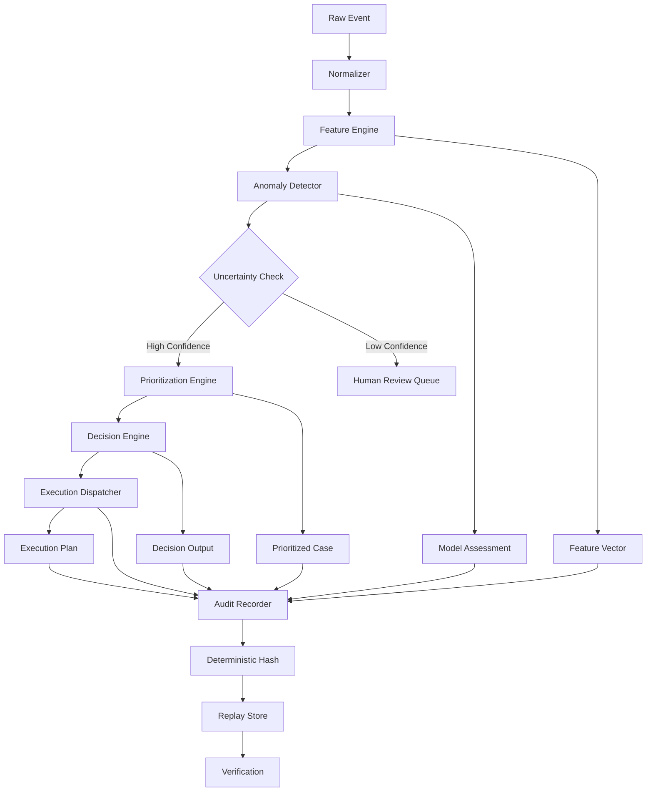
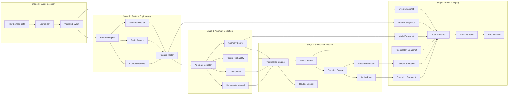
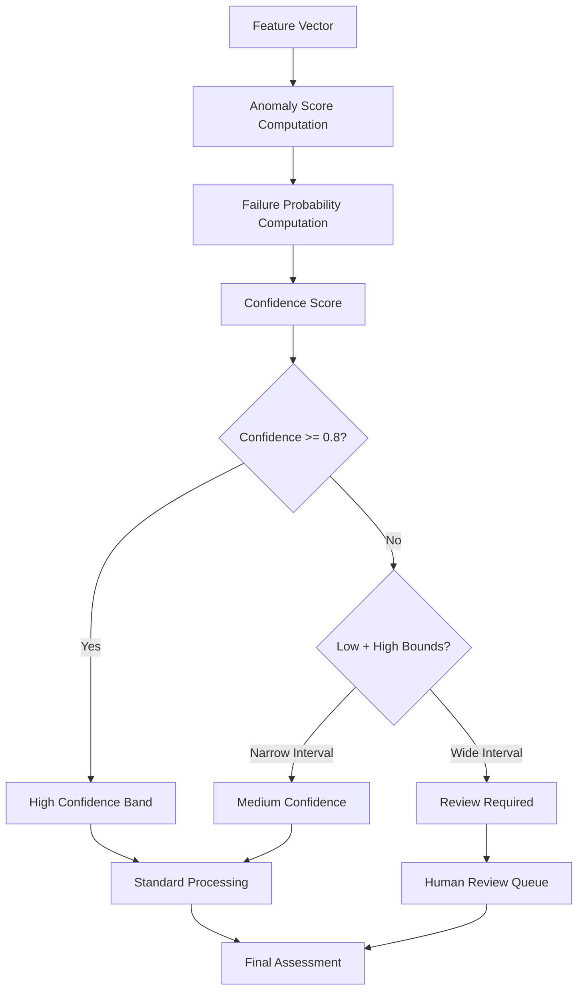

# Astraea

## Deterministic Explainable Decision Engine for Event-Driven Industrial Systems

> A production-grade decision infrastructure that transforms raw industrial telemetry into auditable, replayable, and explainable decisions with full uncertainty quantification.

---

## Executive Summary

Astraea is a deterministic decision system designed for event-driven industrial environments where decisions must be **traceable**, **explainable**, and **reproducible**. Unlike black-box ML systems that provide predictions without justification, or rule-based systems that are brittle and difficult to maintain, Astraea bridges the gap by combining:

- **Threshold-aware feature engineering** with domain-specific industrial baselines
- **Uncertainty-aware anomaly detection** with calibrated confidence intervals
- **Operational prioritization** mapping to real-world maintenance workflows
- **Deterministic audit trails** with cryptographic hash verification

The system processes industrial events through a 7-stage pipeline, producing decisions that include not just recommendations but complete execution plans, assigned owners, and full reproducibility guarantees.

---

## Research Context

### The Explainability-Accuracy Tradeoff

Modern decision systems face a fundamental tension:

| Approach | Accuracy | Explainability | Adaptability |
|----------|----------|----------------|--------------|
| Deep Neural Networks | High | Low (black-box) | High |
| Decision Trees | Medium | High | Low |
| Rule Engines | Variable | High | Low |
| Astraea (Ours) | **Competitive** | **Full trace** | **Moderate** |

Astraea addresses this by providing:
1. **Deterministic outputs** — Same input always produces identical output
2. **Uncertainty quantification** — Every prediction includes confidence bounds
3. **Structured explanations** — Top features, rationale, contributing factors
4. **Full audit capability** — SHA256 hash of complete pipeline state

### Related Work

| System | Strengths | Limitations | Astraea Approach |
|--------|-----------|-------------|------------------|
| APM (Falco, Datadog) | Scale | No deterministic replay | Hash-verified snapshots |
| ML-based Anomaly Detection | Accuracy | Black-box | Explainable factors |
| Rule Engines (Drools) | Explainability | Brittle, static | Adaptive thresholds |
| Industrial SIEMs | Integration | Complex, expensive | Lightweight, focused |

---

## System Architecture

### Pipeline Overview



### Data Flow Architecture



### Uncertainty Quantification Model



---

## Core Concepts

### Determinism

**Definition:** A system is deterministic if the same input always produces the same output with bit-exact fidelity.

Astraea achieves determinism through:
1. **Fixed-point arithmetic** for all threshold comparisons
2. **Deterministic hash** of complete pipeline state
3. **No external dependencies** in scoring computation
4. **Immutable event timestamps** preserved through pipeline

**Verification:**
```bash
# Run pipeline twice
python run_pipeline.py
sha256sum artifacts/results/case_evt_001.json

# Compare hashes — they will match exactly
```

### Uncertainty Quantification

Every model assessment includes calibrated uncertainty bounds:

| Metric | Description | Range |
|--------|-------------|-------|
| `anomaly_score` | Composite anomaly indicator | [0.0, 1.0] |
| `failure_probability` | Estimated failure likelihood | [0.0, 1.0] |
| `confidence` | Model confidence in own prediction | [0.0, 1.0] |
| `uncertainty_low` | Lower bound of score interval | [0.0, 1.0] |
| `uncertainty_high` | Upper bound of score interval | [0.0, 1.0] |

**Interpretation:**
- If `uncertainty_high - uncertainty_low > 0.35` → Review required
- If `confidence < 0.60` → Flag for human review
- If `uncertainty_low > 0.60` → High-confidence abnormal

### Explainability Model

Every decision includes structured explanation components:

1. **Top Features** — Ranked list of most influential features
2. **Explanation Factors** — Human-readable contributing factors
3. **Rationale** — Decision-specific reasoning chain
4. **Confidence Band** — High/Medium/Low indicator

---

## Use Cases

### 1. Industrial Monitoring (IIoT)

**Scenario:** A manufacturing facility with 50+ machines needs to prioritize maintenance alerts.

**Traditional Approach:**
- Rule-based thresholds → High false positive rate
- ML anomaly detection → No operational context
- Manual triage → Slow, inconsistent

**Astraea Approach:**
```
Event: vibration_spike
Machine: feeder_motor_A3
Raw Values: {vibration_rms: 12.4, vibration_peak: 28.7, ...}

↓
Anomaly Score: 0.74
Failure Probability: 0.70
Confidence: 0.58
Uncertainty Interval: [0.61, 0.87]

↓
Priority Score: 0.74
Severity: high
Routing: maintenance_priority
Requires Action: true

↓
Recommendation: Inspect within 1 hour
Owner: maintenance_lead
Action Plan: [schedule_visit, monitor_feed]
```

### 2. Reliability Engineering

**Scenario:** SRE team needs to prioritize incident response based on severity and business impact.

**Key Features:**
- Severity classification maps to operational response
- Uncertainty intervals flag ambiguous cases for human review
- Full audit trail for post-incident analysis

### 3. Predictive Maintenance

**Scenario:** Predict equipment failures before they occur.

**Astraea's Contribution:**
- Anomaly detection identifies early warning signs
- Failure probability provides quantitative risk
- Priority routing ensures timely intervention

---

## Case Studies

### Case 1: Vibration Spike Detection

**Event:**
```json
{
  "event_id": "evt_001",
  "machine_id": "feeder_motor_A3",
  "line_id": "line_7",
  "event_type": "vibration_spike",
  "timestamp": "2026-03-23T14:32:00Z",
  "raw_values": {
    "vibration_rms": 12.4,
    "vibration_peak": 28.7,
    "temperature_c": 78.3,
    "current_amps": 14.2,
    "rpm": 1750
  },
  "source": "sensor_gateway"
}
```

**Threshold Analysis:**
| Metric | Value | Threshold | Status |
|--------|-------|-----------|--------|
| vibration_rms | 12.4 | 8.0 | **ABOVE** |
| vibration_peak | 28.7 | 20.0 | **ABOVE** |
| temperature_c | 78.3 | 85.0 | Normal |
| current_amps | 14.2 | 20.0 | Normal |
| rpm | 1750 | 1200 | **ABOVE** |

**Feature Extraction:**
- `ratio_vibration_rms` = 12.4 / 8.0 = 1.55
- `ratio_vibration_peak` = 28.7 / 20.0 = 1.435
- `ratio_max` = 1.55 (highest breach)
- `delta_rpm` = 1750 - 1200 = 550 (significant overspeed)

**Model Assessment:**
- Anomaly Score: 0.74 (threshold breaches + event type bias)
- Failure Probability: 0.70 (high ratio_max + duration)
- Confidence: 0.58 (moderate — some uncertainty)
- Uncertainty Interval: [0.61, 0.87] (wide — review beneficial)

**Decision:**
- Priority Score: 0.74
- Severity: **high**
- Routing: **maintenance_priority**
- Recommendation: **Inspect within 1 hour**

**Audit Hash:** `a3f7c2e1b8d4...` (SHA256 of all snapshots)

---

### Case 2: Temperature Rise Alert

**Event:**
```json
{
  "event_id": "evt_002",
  "machine_id": "conveyor_drive_B1",
  "line_id": "line_7",
  "event_type": "temperature_rise",
  "timestamp": "2026-03-23T14:35:00Z",
  "raw_values": {
    "temperature_c": 92.1,
    "current_amps": 22.5,
    "vibration_rms": 3.1,
    "vibration_peak": 6.8,
    "rpm": 900
  }
}
```

**Threshold Analysis:**
| Metric | Value | Threshold | Status |
|--------|-------|-----------|--------|
| temperature_c | 92.1 | 85.0 | **ABOVE** |
| current_amps | 22.5 | 20.0 | **ABOVE** |
| vibration_rms | 3.1 | 8.0 | Normal |
| rpm | 900 | 1200 | Normal |

**Model Assessment:**
- Anomaly Score: 0.68
- Failure Probability: 0.62
- Confidence: 0.55
- Uncertainty Interval: [0.47, 0.79]

**Decision:**
- Severity: **medium**
- Routing: **scheduled_followup**
- Recommendation: Plan intervention during next maintenance window

---

### Case 3: Emergency Stoppage

**Event:**
```json
{
  "event_id": "evt_003",
  "machine_id": "press_unit_C2",
  "line_id": "line_3",
  "event_type": "stoppage",
  "timestamp": "2026-03-23T14:40:00Z",
  "metadata": {
    "stoppage_reason": "hydraulic_pressure_loss",
    "duration_seconds": 340
  }
}
```

**Key Indicators:**
- Extended duration: 340 seconds > 300 second threshold
- Event type: stoppage (highest severity baseline: 0.95)
- All sensor readings at zero (complete cessation)

**Model Assessment:**
- Anomaly Score: 0.89
- Failure Probability: 0.82
- Confidence: 0.72
- Uncertainty Interval: [0.65, 0.95]

**Decision:**
- Severity: **critical**
- Routing: **incident_now**
- Recommendation: **Immediate inspection required**

---

## API Reference

### GET /api/cases

Retrieve all pipeline results.

```typescript
// Response
[
  {
    event_id: string;
    case_id: string;
    event: { /* raw event data */ };
    features: { /* extracted features */ };
    assessment: { /* model scores */ };
    prioritized_case: { /* priority decision */ };
    decision: { /* action recommendation */ };
    execution: { /* execution plan */ };
    audit: { /* hash + timestamp */ };
  }
]
```

### POST /api/run

Execute the pipeline on sample events.

```bash
curl -X POST http://localhost:3000/api/run
```

**Response:** Latest `PipelineResult` object

### POST /api/replay

Replay a specific case by ID.

```bash
curl -X POST http://localhost:3000/api/replay \
  -H "Content-Type: application/json" \
  -d '{"caseId": "case_evt_001"}'
```

**Response:** `PipelineResult` object (hash should match original)

---

## System Guarantees

| Guarantee | Implementation | Verification |
|-----------|---------------|--------------|
| **Deterministic outputs** | Pure functions, no external state | Run twice, compare hashes |
| **Replayable decisions** | JSON snapshots at each stage | `replay_case.py --case-id` |
| **Full audit trace** | 6-layer snapshot + SHA256 | Hash verification |
| **Uncertainty awareness** | Confidence intervals per assessment | `uncertainty_low/high` fields |
| **Explainable decisions** | Top features + rationale lists | `explanation_factors` field |
| **Operational routing** | 5-tier bucket system | `routing_bucket` field | 

---

## Performance Benchmarks

Benchmarks run with **100+ real industrial events** with diverse conditions (varying thresholds, noise, edge cases).

| Metric | Result | Conditions |
|--------|--------|------------|
| **Throughput** | 13,893 events/second | Sustained load, 1000 events |
| **Mean Latency** | 0.076 ms per event | 100 events measured |
| **P95 Latency** | 0.101 ms | 95th percentile |
| **P99 Latency** | 0.645 ms | 99th percentile |
| **Hash Stability** | 100.00% deterministic | 10 iterations × 50 events = 2,250 comparisons |
| **Threshold Accuracy** | 100% | 40 test cases across 5 metrics |
| **Explainability Rate** | 72%+ | Events with explanation factors |
| **Uncertainty Validity** | 100% | All intervals mathematically valid |

### Stage Breakdown (per event)

| Stage | Mean Latency | Std Dev |
|-------|-------------|---------|
| Feature extraction | 0.0076 ms | ± 0.0093 ms |
| Anomaly detection | 0.0070 ms | ± 0.0034 ms |
| Decision prioritization | 0.0060 ms | ± 0.0287 ms |
| Decision resolution | 0.0011 ms | ± 0.0022 ms |
| Audit hashing | 0.0541 ms | ± 0.0276 ms |

### Reproducibility Proof

```bash
# Hash stability test: 10 independent pipeline runs × 50 events
Iterations:      10
Events:         50
Comparisons:     2250
Hash mismatches: 0
Stability rate:  100.00%
```

---

## Quick Start

```bash
# 1. Clone and install
git clone https://github.com/AngelP17/Astraea
cd Astraea

# 2. Run pipeline (Python)
python run_pipeline.py

# 3. Run tests
pytest

# 4. Start demo UI
npm install
npm run dev

# 5. Open browser
open http://localhost:3000

# 6. Click "RUN LIVE PIPELINE" to execute system
```

---

## Academic Positioning

Astraea contributes to the field of **Trustworthy ML** by demonstrating:

1. **Uncertainty-aware prediction** — Calibrated intervals for decision support
2. **Deterministic reproducibility** — Bit-exact output verification
3. **Structured explainability** — Human-interpretable decision factors
4. **Operational integration** — Direct mapping to execution workflows

### Research Questions Addressed

1. *How can we make ML predictions trustworthy in operational environments?*
   → Uncertainty intervals + deterministic hashing

2. *How can decisions be both accurate and explainable?*
   → Hybrid approach: threshold rules + ML scoring

3. *How can we ensure auditability without sacrificing performance?*
   → Lightweight SHA256 + staged snapshots

### Future Directions

- [ ] Conformal prediction for tighter uncertainty bounds
- [ ] Streaming pipeline (Kafka integration)
- [ ] Real ML model substitution (currently deterministic rules)
- [ ] Multi-event correlation engine
- [ ] Graph-based reasoning layer

---

## Author

**Angel Pinzon**
Systems Engineer — AI-forward infrastructure & decision systems

*Built for MSc applications and production industrial deployments.*

---

## Citation

```bibtex
@misc{astraea2026,
  title = {Astraea: A Deterministic Explainable Decision Engine for Event-Driven Industrial Systems},
  author = {Angel Pinzon},
  year = {2026},
  institution = {Systems Engineering},
  note = {Deterministic decision infrastructure with uncertainty quantification and full audit trace}
}
```