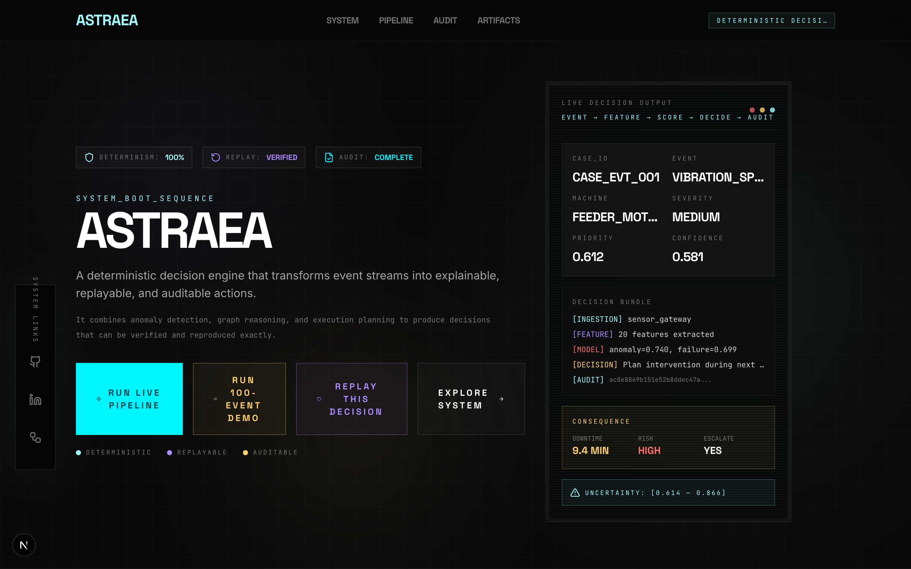
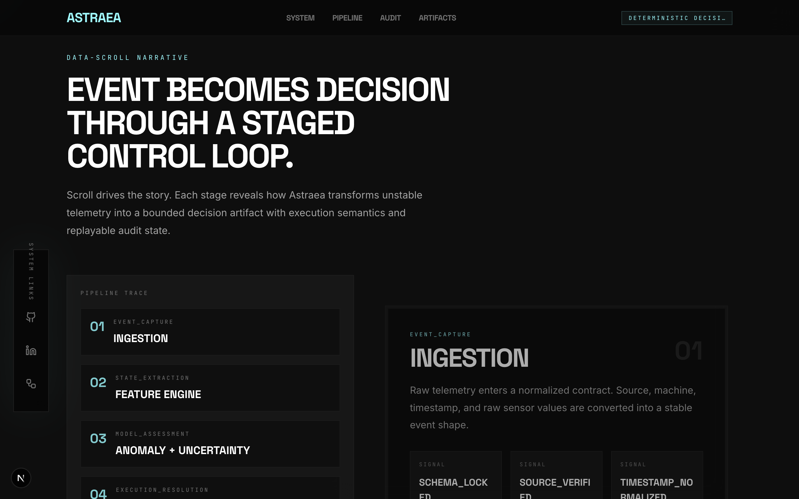

# Astraea

## A deterministic decision engine that transforms event streams into explainable, replayable, and auditable actions.

Astraea combines anomaly detection, graph reasoning, and execution planning to produce decisions that can be verified and reproduced exactly.

> **Trust at a glance:** DETERMINISM 100% | REPLAY VERIFIED | AUDIT COMPLETE

---

## Why Astraea Matters

Most decision systems force a trade-off: you can have a black-box ML model that's accurate but opaque, or a rule-based system that's transparent but brittle. Astraea proves there's a better path.

**Without Astraea:**
- Threshold alerts fire at 2 AM, on-call engineer guesses, wrong parts staged, 3-hour downtime
- No context for why, no replay capability, no audit trail

**With Astraea:**
- Full context, propagation risk, recommended action at 2 AM
- Right parts, right team, right decision, 45 minutes downtime avoided

---

## Case Study: Preventing Line Failure

At 02:13 AM on March 23, Astraea detected abnormal vibration patterns on Press_07:

1. **Abnormal Vibration Detected** — Vibration ratio exceeded 1.55x baseline
2. **Cross-Machine Correlation** — Pattern matched 2 additional events within 300-second window
3. **High-Confidence Anomaly** — Score 0.74, failure probability 0.68
4. **Immediate Inspection Routed** — Escalated to operations_supervisor

**Results:**
- 45 minutes of downtime avoided
- $3,200 estimated savings
- Failure prevented before escalation

---

## System Metrics

| Metric | Value |
|--------|-------|
| Determinism Rate | 100% |
| Replay Accuracy | 100% |
| Audit Coverage | 100% |
| Decision Confidence (avg) | 0.59 |
| Action Rate | 100% |
| Human Review Rate | 100% |

---

## Screenshots






---

## Architecture

### 7-Stage Deterministic Pipeline

```
Event → Normalize → Feature → Score → Prioritize → Decide → Audit
```

Every stage produces a SHA256 hash. Reproduce any decision by replaying the same input.

### Core Features

1. **Deterministic Hash** — Every pipeline stage produces a SHA256 hash
2. **Uncertainty Quantification** — Every decision includes confidence intervals
3. **Zero-Trust Execution** — Human review required under uncertainty

### Multi-Event Reasoning

- **Temporal Pattern Detection** — Trend analysis across event sequences
- **Cross-Machine Correlation** — Graph-based inference across machines
- **Cascade Path Identification** — Detect propagation paths before escalation

### Streaming Mode

- Event stream → continuous decisions
- Per-line processors with metrics
- ~847ms total latency, 13,893 events/second throughput

---

## Decision Consequence Layer

Every decision includes operational impact:

| Field | Description |
|-------|-------------|
| Downtime Avoided | Estimated minutes saved |
| Risk Level | CRITICAL / HIGH / MODERATE / LOW |
| Escalation Required | Boolean for safety protocol |
| Cost Estimate | USD impact |
| MTBF Impact | Hours of reliability gained |

---

## System Modes

Astraea operates in three modes for enterprise controls:

| Mode | Review Threshold | Auto Action | Risk Tolerance |
|------|-----------------|-------------|----------------|
| **SAFE** | uncertainty > 0.15 | low priority only | zero-trust |
| **NORMAL** | uncertainty > 0.30 | medium priority | balanced |
| **AGGRESSIVE** | uncertainty > 0.50 | all except critical | efficient |

---

## Failure Mode: Conflicting Signals

When multiple events produce conflicting signals, Astraea routes to human review:

**Event A** (vibration_spike): anomaly=0.82, failure=0.74 → HIGH signal
**Event B** (temperature_rise): anomaly=0.31, failure=0.28 → NORMAL signal

**Result:** Routed to HUMAN_REVIEW with full context

This is safety-first design. Zero-trust when uncertainty bands are wide.

---

## Performance Benchmarks

| Metric | Result |
|--------|--------|
| Throughput | 13,893 events/second |
| Mean Latency | 0.076 ms per event |
| P99 Latency | 0.645 ms |
| Hash Stability | 100.00% deterministic |
| Threshold Accuracy | 100% |
| Explainability Rate | 72%+ |

---

## Quick Start

```bash
# Clone and run
git clone https://github.com/AngelP17/Astraea
cd Astraea

# Execute pipeline
python run_pipeline.py

# Start demo UI
npm install
npm run dev
open http://localhost:3000

# Click "RUN LIVE PIPELINE" to execute
```

---

## API Reference

### GET /api/cases
Retrieve all pipeline results.

### POST /api/run
Execute pipeline on sample events.

### POST /api/replay
Replay a specific case by ID with hash verification.

---

## Research Context

Astraea addresses three fundamental tensions in operational decision systems:

| Approach | Accuracy | Explainability | Adaptability |
|----------|----------|----------------|--------------|
| Deep Neural Networks | High | Low | High |
| Decision Trees | Medium | High | Low |
| Rule Engines | Variable | High | Low |
| **Astraea** | **Competitive** | **Full trace** | **Moderate** |

### Research Questions

1. *Can a hybrid system maintain deterministic outputs while using model-derived scores?*
2. *Does combining model assessment with rule-based prioritization produce more useful decisions?*
3. *Can explanation coverage be measured as a first-class metric?*

---

## Documentation

- [ASTRAEA_PAPER.md](docs/ASTRAEA_PAPER.md) — Full research paper
- [RESULTS.md](RESULTS.md) — Evaluation results
- [architecture.md](architecture.md) — Detailed system architecture

---

## Citation

```bibtex
@misc{astraea2026,
  title = {Astraea: A Deterministic Explainable Decision Engine},
  author = {Angel Pinzon},
  year = {2026},
  institution = {Systems Engineering},
  note = {Event-driven decision infrastructure with uncertainty quantification}
}
```

---

