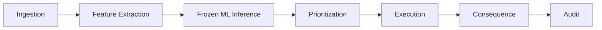
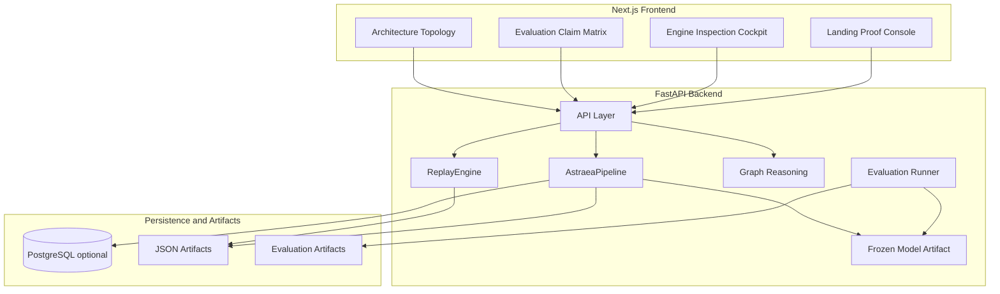

# Astraea

[](https://github.com/AngelP17/Astraea/actions/workflows/ci.yml)
[](https://github.com/AngelP17/Astraea/actions/workflows/deploy.yml)

Deterministic operational decision infrastructure for industrial telemetry. Astraea turns machine events into explainable actions, stage hashes, replay verification, and audit artifacts.

The project is intentionally claim-driven: every public claim should map to code, tests, and a generated artifact in [docs/CLAIM_MATRIX.md](docs/CLAIM_MATRIX.md).

## Current Status

| Claim | Status | Evidence |
|-------|--------|----------|
| Determinism 100% | Verified | Stable bundle hash and per-stage hashes across repeated runs |
| Replay verified | Verified | Replay re-executes the original event and compares stored vs recomputed hashes |
| Every stage produces a SHA256 hash | Verified | Seven canonical stages emit individual hashes |
| Audit complete | Verified | Event, feature, assessment, decision, execution, consequence, and audit snapshots are stored |
| Streaming mode | Measured | SSE demo stream follows the seven canonical stages |
| Benchmark metrics | Measured | Generated from `uv run python -m backend.evaluation.run_eval` |
| Graph-lite cascade reasoning | Partial | Graph engine is wired into demo/session context, not single-event inference |
| Deterministic ML inference | Verified | Frozen logistic model artifact and model card are generated by the eval harness |
| Floci cloud path | Partial | Optional local emulation hooks exist; production deployment is not claimed |

## What It Does

1. Ingests industrial machine events.
2. Extracts deterministic features.
3. Scores risk with a frozen deterministic logistic model.
4. Prioritizes the case and decides whether to route to human review or incident handling.
5. Estimates consequence and operational exposure.
6. Emits a hash-bound audit record.
7. Replays stored cases by re-running the original event and comparing hashes.

## Architecture

### Seven-Stage Deterministic Pipeline


```mermaid
flowchart LR
    A[Ingestion] --> B[Feature Extraction]
    B --> C[Frozen ML Inference]
    C --> D[Prioritization]
    D --> E[Execution]
    E --> F[Consequence]
    F --> G[Audit]
```

Each stage produces a SHA256 hash. The final deterministic hash is computed from the canonical sorted-key JSON bundle.

### System Topology


```mermaid
flowchart TB
    subgraph Frontend["Next.js Frontend"]
        H[Landing Proof Console]
        E[Engine Inspection Cockpit]
        V[Evaluation Claim Matrix]
        T[Architecture Topology]
    end

    subgraph Backend["FastAPI Backend"]
        API[API Layer]
        PIPE[AstraeaPipeline]
        REPLAY[ReplayEngine]
        GRAPH[Graph Reasoning]
        EVAL[Evaluation Runner]
        MODEL[Frozen Model Artifact]
    end

    subgraph Data["Persistence and Artifacts"]
        DB[(PostgreSQL optional)]
        FS[JSON Artifacts]
        METRICS[Evaluation Artifacts]
    end

    H --> API
    E --> API
    V --> API
    T --> API
    API --> PIPE
    API --> REPLAY
    API --> GRAPH
    EVAL --> METRICS
    EVAL --> MODEL
    PIPE --> MODEL
    PIPE --> DB
    PIPE --> FS
    REPLAY --> FS
```

## Product Surfaces

- `/` shows the proof-first landing console.
- `/engine` inspects stored cases and replay verification.
- `/evaluation` renders measured evaluation output and the claim-to-proof matrix.
- `/architecture` shows topology, health, and graph/session context.

If the backend is offline, the frontend shows an explicit offline state. It should not fabricate hashes, replay results, or benchmark numbers.

## Measured Evaluation

The latest generated artifact is [artifacts/evaluation/eval_latest.json](artifacts/evaluation/eval_latest.json), produced from a labeled synthetic dataset of 500 cases.

| Metric | Latest Result |
|--------|---------------|
| Evaluated cases | 500 |
| Hash consistency | 100.00% |
| Replay pass rate | 100.00% |
| Audit completeness | 100.00% |
| Rationale coverage | 100.00% |
| Throughput | 6,237.48 events/sec |
| Mean latency | 0.1603 ms |
| P99 latency | 0.2086 ms |

Baseline comparison from the same artifact:

| System | Precision | Recall | Routing Accuracy | False Escalation |
|--------|-----------|--------|------------------|------------------|
| Static threshold alerter | 0.6250 | 1.0000 | 0.7000 | 0.6000 |
| Deterministic scoring only | 0.8333 | 1.0000 | 0.9000 | 0.2000 |
| Frozen logistic model | 1.0000 | 1.0000 | 1.0000 | 0.0000 |
| Astraea decision engine | 1.0000 | 1.0000 | 1.0000 | 0.0000 |

This is a measured synthetic benchmark, not a production plant benchmark. The current model performs perfectly on the generated held-out synthetic distribution; that is useful proof of deterministic model wiring, not proof of real-world generalization.

Regenerate the artifact with:

```bash
uv run python -m backend.evaluation.run_eval
```

## Quick Start

```bash
git clone https://github.com/AngelP17/Astraea
cd Astraea
git config core.hooksPath .githooks
```

Install and run the frontend:

```bash
npm install
npm run dev
```

Install and run the backend:

```bash
uv sync
uv run uvicorn backend.api.main:app --reload
```

Open `http://localhost:3000`.

## Environment

Copy `.env.example` to `.env` and set values as needed:

- `DATABASE_URL` for PostgreSQL persistence
- `SECRET_KEY` for JWT signing
- `NEXT_PUBLIC_API_URL` for the frontend-to-backend API origin
- `ARTIFACTS_*` settings for artifact retention
- `FLOCI_*` settings only when using optional local Floci emulation

## Quality Gates

Use these checks before treating a change as complete:

```bash
uv run ruff check backend tests
uv run pytest -q tests
npm run typecheck
npm run build
npm run lint
npm run test:e2e
python3 scripts/scan_staged_secrets.py --all-files
```

The evaluation artifact is generated separately:

```bash
uv run python -m backend.evaluation.run_eval
```

## API Reference

| Endpoint | Purpose |
|----------|---------|
| `GET /api/cases` | List full pipeline results with optional filters |
| `GET /api/cases/{case_id}` | Retrieve one full case |
| `POST /api/run` | Execute the pipeline on sample events |
| `POST /api/replay` | Legacy replay verification by request body |
| `POST /api/replay/{case_id}` | Re-execute a stored event and compare hashes |
| `POST /api/demo` | Run the 100-event demo batch and attach graph context |
| `GET /api/demo/stream` | Server-Sent Events stream for the seven-stage pipeline |
| `GET /api/claims` | Claim-to-proof matrix for frontend/docs |
| `GET /api/evaluation/latest` | Latest measured evaluation artifact |
| `GET /api/health/deep` | Runtime health, artifact, DB, and optional Floci status |
| `GET /api/v1/observability/benchmarks` | Benchmark view derived from the latest evaluation artifact |
| `POST /api/admin/cleanup` | Admin-only artifact cleanup |

## Repository Guardrails

Astraea includes tracked secret protection:

1. Local pre-commit hook via `.githooks/pre-commit`
2. CI secret scan in `.github/workflows/ci.yml`

Use:

```bash
python3 scripts/scan_staged_secrets.py
python3 scripts/scan_staged_secrets.py --all-files
```

## Deployment Notes

The Kubernetes deploy workflow expects these GitHub Actions secrets:

- `KUBE_CONFIG`
- `SECRET_KEY`
- `DB_HOST`
- `DB_PORT`
- `DB_NAME`
- `DB_USER`
- `DB_PASSWORD`

Optional ingress support also uses:

- `K8S_TLS_CERT`
- `K8S_TLS_KEY`

Set the GitHub Actions variable `K8S_INGRESS_HOST` only when ingress should be applied.

The Floci path is currently documented as optional local cloud emulation, not production deployment. See [docs/deployment/floci.md](docs/deployment/floci.md).

## Limitations

- Current event data is generated synthetic industrial telemetry.
- The frozen model is trained and evaluated on generated synthetic telemetry.
- The deterministic scoring path remains as a baseline/fallback.
- Graph reasoning is wired into demo/session context, not every single-event pipeline result.
- Benchmarks are reproducible local synthetic benchmarks, not external plant throughput claims.
- Replay verification is stable for the same software version and deterministic code path.
- Optional Floci support is local emulation until real deployment evidence exists.

## Documentation

- [docs/CLAIM_MATRIX.md](docs/CLAIM_MATRIX.md) - public claim to code/test/artifact map
- [docs/MODEL_CARD.md](docs/MODEL_CARD.md) - frozen model card and synthetic evaluation notes
- [RESULTS.md](RESULTS.md) - latest generated evaluation summary
- [docs/ASTRAEA_PAPER.md](docs/ASTRAEA_PAPER.md) - research context
- [architecture.md](architecture.md) - legacy architecture notes
- [AGENTS.md](AGENTS.md) - repo guidance for future Codex sessions

## Citation

```bibtex
@misc{astraea2026,
  title = {Astraea: A Deterministic Explainable Decision Engine},
  author = {Angel Pinzon},
  year = {2026},
  institution = {Systems Engineering},
  note = {Event-driven decision infrastructure with uncertainty quantification}
}
```
