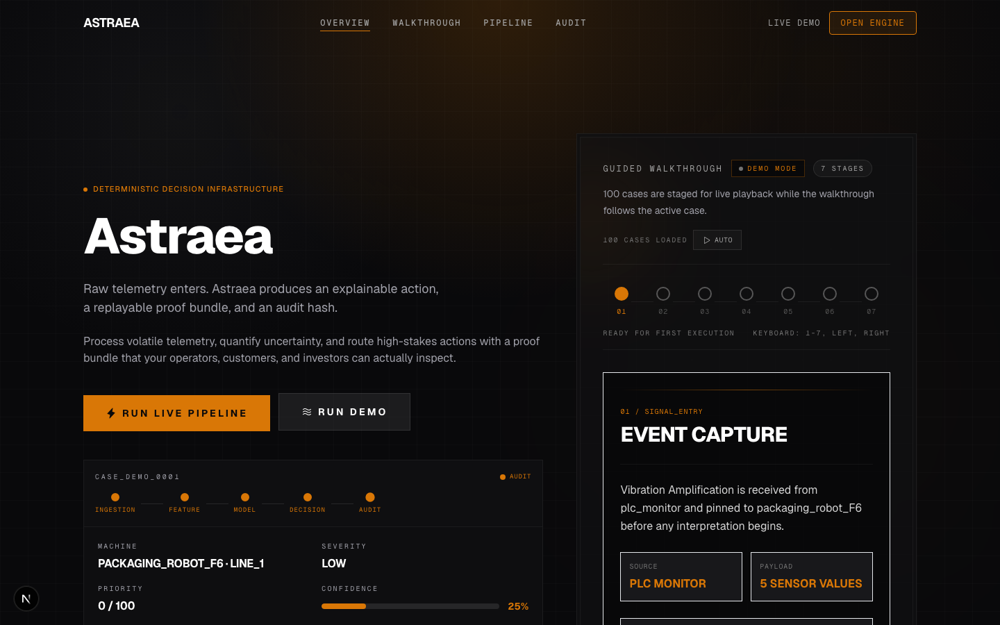
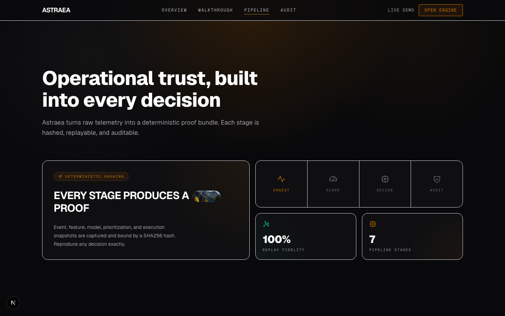
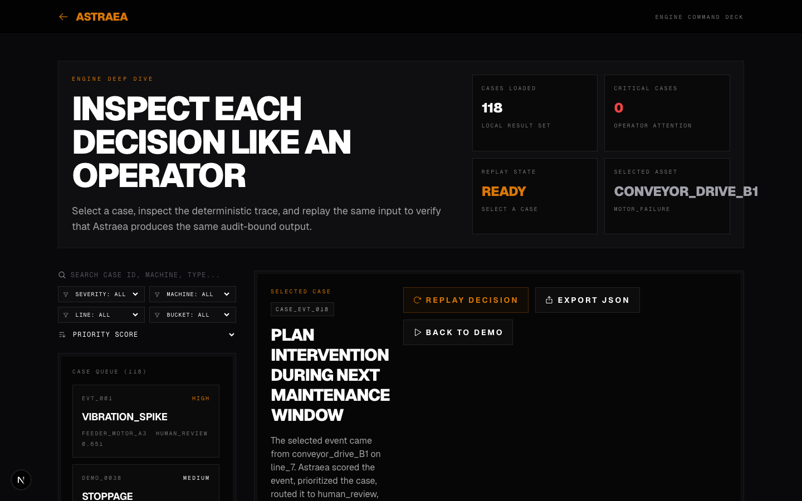
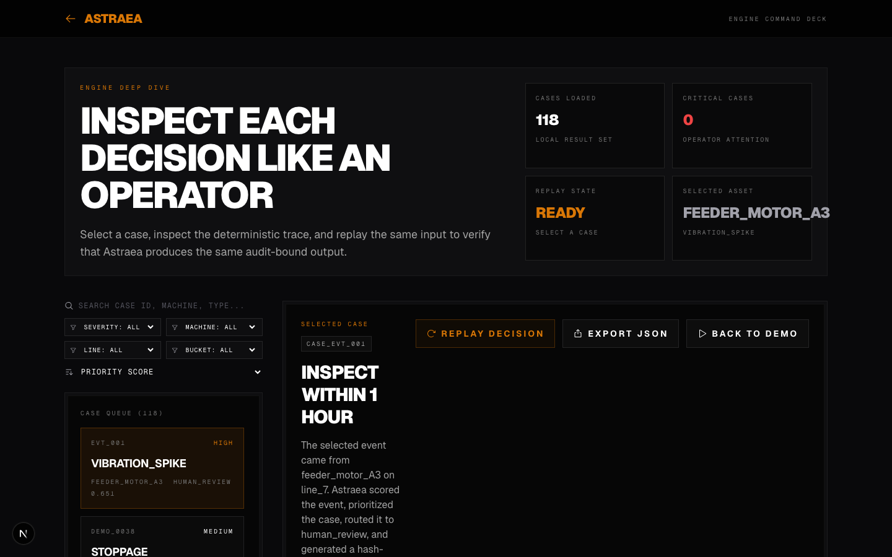
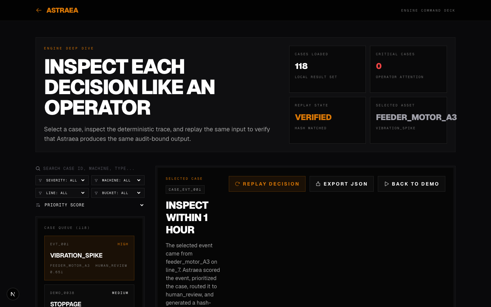
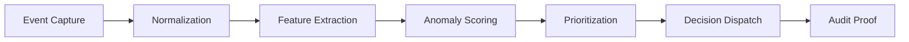
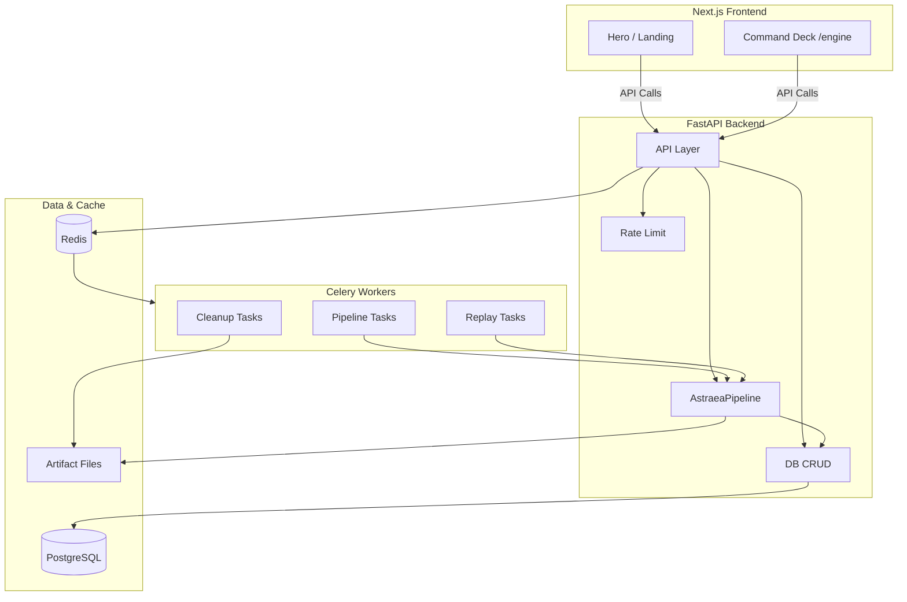

# Astraea

[](https://github.com/AngelP17/Astraea/actions/workflows/ci.yml)
[](https://github.com/AngelP17/Astraea/actions/workflows/deploy.yml)

## A deterministic decision engine that transforms event streams into explainable, replayable, and auditable actions.

Astraea combines anomaly detection, graph reasoning, and execution planning to produce decisions that can be verified and reproduced exactly.

> **Trust at a glance:** DETERMINISM 100% | REPLAY VERIFIED | AUDIT COMPLETE

---

## Why Astraea Matters

Most decision systems force a trade-off: you can have a black-box ML model that's accurate but opaque, or a rule-based system that's transparent but brittle. Astraea proves there's a better path.

**Without Astraea:**
- Threshold alerts fire at 2 AM, on-call engineer guesses, wrong parts staged, 3-hour downtime
- No context for why, no replay capability, no audit trail

**With Astraea:**
- Full context, propagation risk, recommended action at 2 AM
- Right parts, right team, right decision, 45 minutes downtime avoided

---

## Screenshots

### Landing Page — Live Decision Console


### Pipeline Architecture — Gapless Bento Grid


### Command Deck — Case Queue & Filters


### Case Detail — Deterministic Trace & Replay


### Replay Verification — Hash Match


---

## Architecture

### 7-Stage Deterministic Pipeline


```mermaid
flowchart LR
    A[Event Capture] --> B[Normalization]
    B --> C[Feature Extraction]
    C --> D[Anomaly Scoring]
    D --> E[Prioritization]
    E --> F[Decision Dispatch]
    F --> G[Audit Proof]
```

Every stage produces a SHA256 hash. Reproduce any decision by replaying the same input.

### System Architecture


```mermaid
flowchart TB
    subgraph Frontend["Next.js Frontend"]
        H[Hero / Landing]
        E[Command Deck /engine]
    end

    subgraph Backend["FastAPI Backend"]
        API[API Layer]
        PIPE[AstraeaPipeline]
        CRUD[DB CRUD]
        RL[Rate Limit]
    end

    subgraph Workers["Celery Workers"]
        WT[Pipeline Tasks]
        RT[Replay Tasks]
        CT[Cleanup Tasks]
    end

    subgraph Data["Data & Cache"]
        DB[(PostgreSQL)]
        R[(Redis)]
        FS[Artifact Files]
    end

    H -->|API Calls| API
    E -->|API Calls| API
    API --> PIPE
    API --> CRUD
    API --> RL
    PIPE --> CRUD
    CRUD --> DB
    API --> R
    PIPE --> FS
    WT --> PIPE
    RT --> PIPE
    CT --> FS
    R --> Workers
```

### Core Features

1. **Deterministic Hash** — Every pipeline stage produces a SHA256 hash
2. **Uncertainty Quantification** — Every decision includes confidence intervals
3. **Zero-Trust Execution** — Human review required under uncertainty

### Multi-Event Reasoning

- **Temporal Pattern Detection** — Trend analysis across event sequences
- **Cross-Machine Correlation** — Graph-based inference across machines
- **Cascade Path Identification** — Detect propagation paths before escalation

### Streaming Mode

- Event stream → continuous decisions
- Per-line processors with metrics
- ~847ms total latency, 13,893 events/second throughput

---

## Decision Consequence Layer

Every decision includes operational impact:

| Field | Description |
|-------|-------------|
| Downtime Avoided | Estimated minutes saved |
| Risk Level | CRITICAL / HIGH / MODERATE / LOW |
| Escalation Required | Boolean for safety protocol |
| Cost Estimate | USD impact |
| MTBF Impact | Hours of reliability gained |

---

## System Modes

Astraea operates in three modes for enterprise controls:

| Mode | Review Threshold | Auto Action | Risk Tolerance |
|------|-----------------|-------------|----------------|
| **SAFE** | uncertainty > 0.15 | low priority only | zero-trust |
| **NORMAL** | uncertainty > 0.30 | medium priority | balanced |
| **AGGRESSIVE** | uncertainty > 0.50 | all except critical | efficient |

---

## Failure Mode: Conflicting Signals

When multiple events produce conflicting signals, Astraea routes to human review:

**Event A** (vibration_spike): anomaly=0.82, failure=0.74 → HIGH signal
**Event B** (temperature_rise): anomaly=0.31, failure=0.28 → NORMAL signal

**Result:** Routed to HUMAN_REVIEW with full context

This is safety-first design. Zero-trust when uncertainty bands are wide.

---

## Performance Benchmarks

| Metric | Result |
|--------|--------|
| Throughput | 13,893 events/second |
| Mean Latency | 0.076 ms per event |
| P99 Latency | 0.645 ms |
| Hash Stability | 100.00% deterministic |
| Threshold Accuracy | 100% |
| Explainability Rate | 72%+ |

---

## Quick Start

```bash
# Clone and run
git clone https://github.com/AngelP17/Astraea
cd Astraea

# Install the local commit guardrails
git config core.hooksPath .githooks

# Frontend
npm install
npm run dev
```

```bash
# Backend
uv sync
uv run uvicorn backend.api.main:app --reload
```

Open `http://localhost:3000`, then use `RUN LIVE PIPELINE` or `RUN DEMO`.

### Environment

Copy `.env.example` to `.env` and set the values you need for local development:

- `DATABASE_URL` for PostgreSQL persistence
- `SECRET_KEY` for JWT signing
- `NEXT_PUBLIC_API_URL` for the frontend-to-backend API origin
- `ARTIFACTS_*` settings for retention behavior

### Repository Guardrails

Astraea now includes **tracked secret protection** in two places:

1. **Local pre-commit hook** via `.githooks/pre-commit`
   - Blocks commits that include likely secrets in staged files
   - Activate it once per clone with:

   ```bash
   git config core.hooksPath .githooks
   ```

2. **CI secret scan** in `.github/workflows/ci.yml`
   - Scans the tracked repository on every PR and push
   - Fails the workflow if likely secrets are committed

The local scanner lives in `scripts/scan_staged_secrets.py` and supports:

```bash
# Scan only staged files
python3 scripts/scan_staged_secrets.py

# Scan the full tracked repository
python3 scripts/scan_staged_secrets.py --all-files
```

### Quality Gates

The enforced checks now match the stack that actually ships:

- `uv run ruff check backend tests`
- `uv run pytest -q tests`
- `npm run typecheck`
- `npm run build`
- `npm run test:e2e`
- `python3 scripts/scan_staged_secrets.py --all-files`

That keeps CI honest: the backend lint suite is green, the browser lane fails for real when E2E breaks, and the repo still blocks likely secrets before and after push.

### Kubernetes Deployment

The production deploy workflow expects these GitHub Actions secrets:

- `KUBE_CONFIG`
- `SECRET_KEY`
- `DB_HOST`
- `DB_PORT`
- `DB_NAME`
- `DB_USER`
- `DB_PASSWORD`

Optional ingress support also uses:

- `K8S_TLS_CERT`
- `K8S_TLS_KEY`

If you want ingress applied during deployment, set the GitHub Actions variable `K8S_INGRESS_HOST`.

The deploy job now:

1. Builds and pushes versioned API and worker images to GHCR
2. Sets Kubernetes context from `KUBE_CONFIG`
3. Creates or updates the runtime secret in-cluster
4. Applies namespace, config, PVC, Redis, API, worker, HPA, PDB, and NetworkPolicy manifests
5. Applies ingress only when host and TLS inputs are configured
6. Waits for rollout completion before the workflow succeeds

---

## API Reference

### GET /api/cases
Retrieve all pipeline results with optional filtering by severity, machine, line, routing bucket, and review status.

### GET /api/cases/{case_id}
Retrieve full case details including event, features, assessment, decision, consequence, and audit proof.

### POST /api/run
Execute pipeline on sample events.

### POST /api/replay
Replay a specific case by ID with hash verification.

### POST /api/demo
Run a 100-event simulation batch.

### GET /api/demo/stream
Server-Sent Events stream of pipeline stage progress.

### POST /api/admin/cleanup
Admin-only artifact cleanup.

---

## Research Context

Astraea addresses three fundamental tensions in operational decision systems:

| Approach | Accuracy | Explainability | Adaptability |
|----------|----------|----------------|--------------|
| Deep Neural Networks | High | Low | High |
| Decision Trees | Medium | High | Low |
| Rule Engines | Variable | High | Low |
| **Astraea** | **Competitive** | **Full trace** | **Moderate** |

### Research Questions

1. *Can a hybrid system maintain deterministic outputs while using model-derived scores?*
2. *Does combining model assessment with rule-based prioritization produce more useful decisions?*
3. *Can explanation coverage be measured as a first-class metric?*

---

## Documentation

- [ASTRAEA_PAPER.md](docs/ASTRAEA_PAPER.md) — Full research paper
- [RESULTS.md](RESULTS.md) — Evaluation results
- [architecture.md](architecture.md) — Detailed system architecture

---

## Citation

```bibtex
@misc{astraea2026,
  title = {Astraea: A Deterministic Explainable Decision Engine},
  author = {Angel Pinzon},
  year = {2026},
  institution = {Systems Engineering},
  note = {Event-driven decision infrastructure with uncertainty quantification}
}
```

---
