# Astraea Architecture

## System Overview

Astraea is a deterministic explainable decision engine for event-driven industrial systems. It transforms raw telemetry into auditable, replayable decisions with full uncertainty quantification.

---

## High-Level Architecture

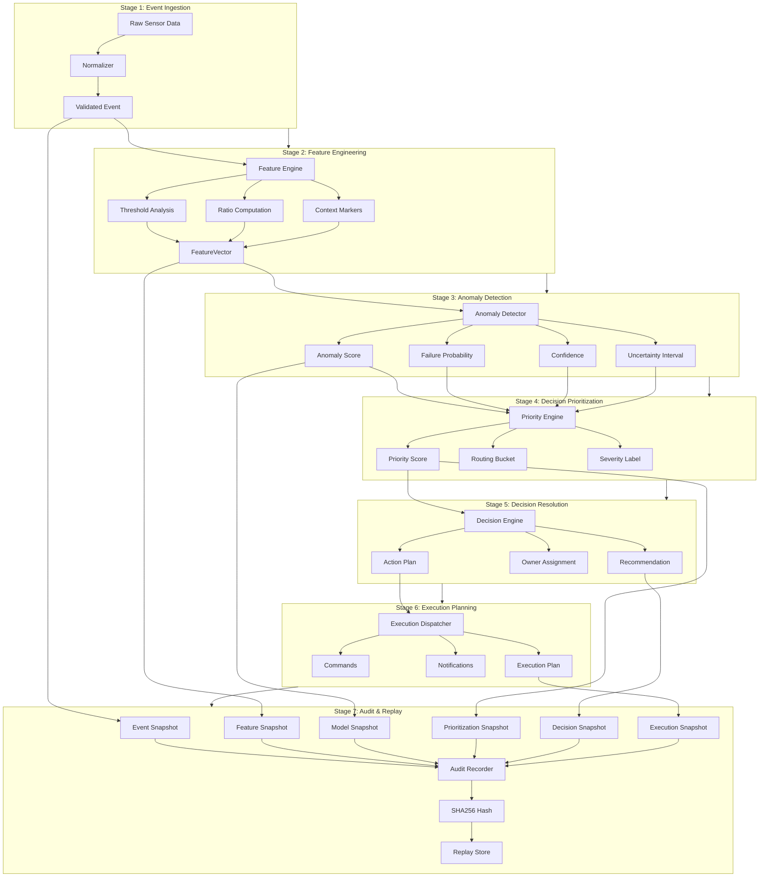

---

## Data Flow

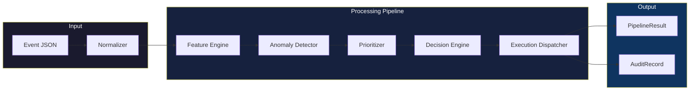

---

## Pipeline Stage Details

### Stage 1: Event Ingestion

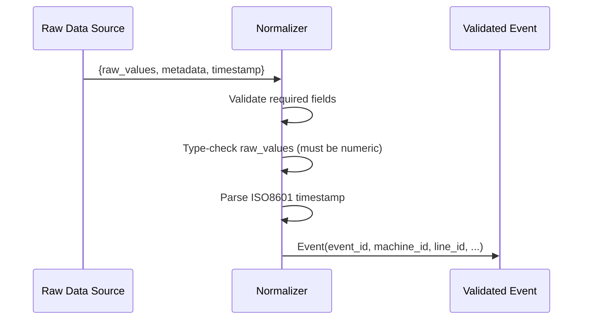

**Responsibilities:**
- Validate all required fields exist
- Ensure `raw_values` are numeric (float)
- Parse ISO8601 timestamps with timezone support
- Normalize metadata structure

---

### Stage 2: Feature Engineering

```mermaid
flowchart TD
    A[Raw Values] --> B{For each metric}
    B -->|Yes| C[raw_{key}]
    B -->|Yes| D[delta_{key}]
    B -->|Yes| E[ratio_{key}]
    B -->|Yes| F[{key}_above_threshold]
    C --> G[FeatureVector]
    D --> G
    E --> G
    F --> G
    B -->|No| H[Next metric]
    
    G --> I[ratio_max]
    G --> J[ratio_mean]
    G --> K[delta_max]
    G --> L[delta_mean]
```

**Thresholds Configuration:**
```python
THRESHOLDS = {
    "vibration_rms": 8.0,    # mm/s
    "vibration_peak": 20.0,  # mm/s
    "temperature_c": 85.0,    # Celsius
    "current_amps": 20.0,    # Amperes
    "rpm": 1200.0,           # Revolutions/min
}
```

**Event Baselines:**
```python
EVENT_BASELINES = {
    "vibration_spike": 0.90,
    "temperature_rise": 0.75,
    "stoppage": 0.95,
    "current_surge": 0.70,
    "pressure_anomaly": 0.80,
}
```

---

### Stage 3: Anomaly Detection

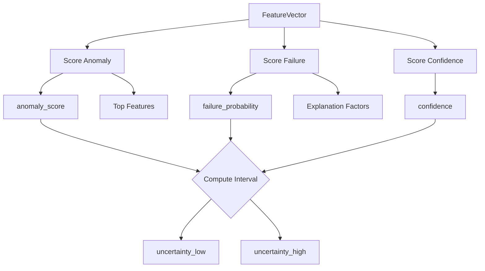

**Scoring Formulas:**

```python
# Anomaly Score
anomaly_score = (
    0.45 * threshold_component +
    0.35 * event_bias +
    duration_bonus +
    ratio_bonus
)

# Failure Probability
failure_probability = (
    0.45 * ratio_factor +
    0.35 * delta_factor +
    0.20 * duration_factor
)

# Confidence
confidence = (
    0.65 * top_signal +
    source_bonus +
    consistency_bonus
)
```

---

### Stage 4: Decision Prioritization

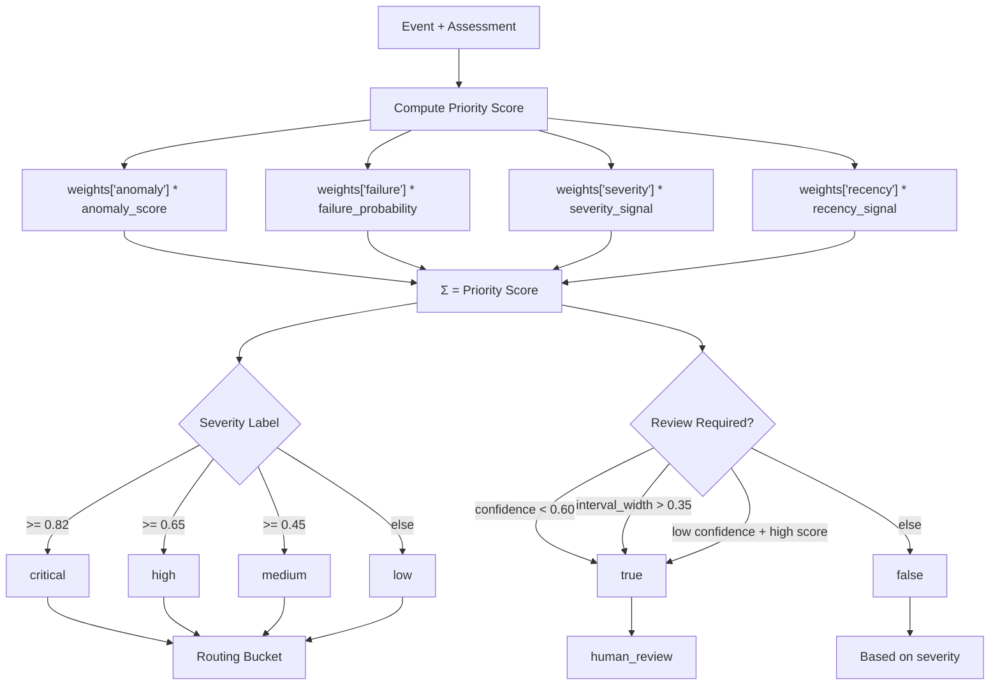

**Priority Weights:**
```python
weights = {
    "anomaly": 0.38,    # Primary signal weight
    "failure": 0.30,    # Secondary signal weight
    "severity": 0.22,    # Event type baseline
    "recency": 0.10,     # Time decay factor
}
```

---

### Stage 5: Decision Resolution

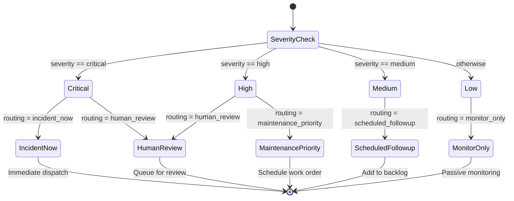

---

### Stage 6: Execution Planning

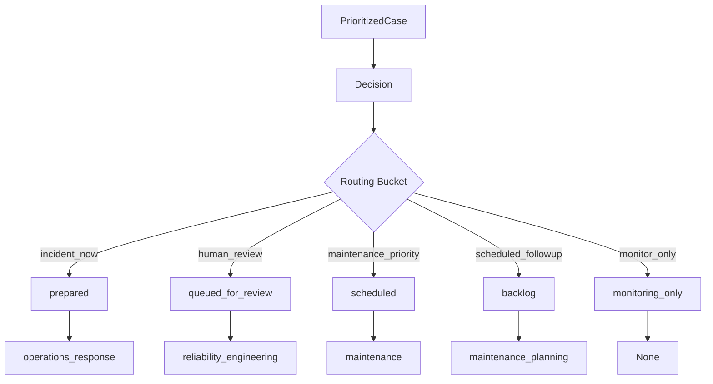

---

### Stage 7: Audit Recording

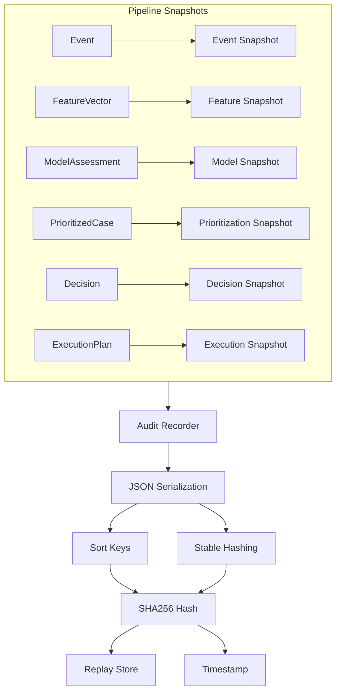

---

## Uncertainty Quantification Model

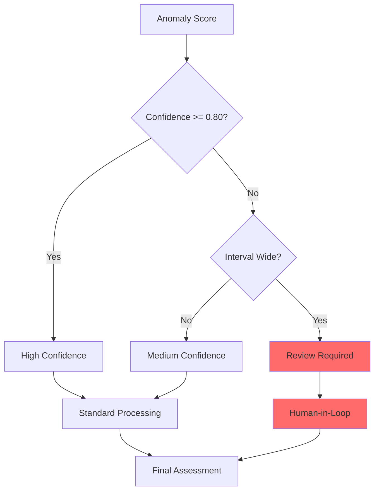

**Uncertainty Interval Computation:**
```python
spread = max(0.05, 0.30 * (1.0 - confidence))
low = max(0.0, anomaly_score - spread)
high = min(1.0, anomaly_score + spread)
```

---

## Routing Bucket System

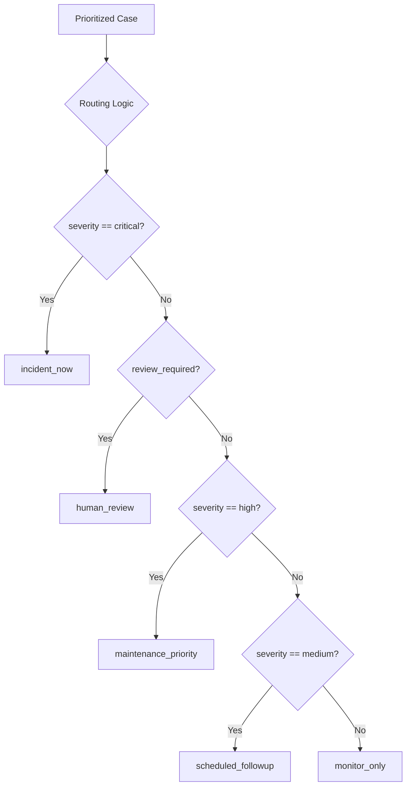

| Bucket | Severity | Action | Team |
|--------|----------|--------|------|
| `incident_now` | critical | Immediate dispatch | operations_response |
| `human_review` | any (review flag) | Queue for review | reliability_engineering |
| `maintenance_priority` | high | Schedule work order | maintenance |
| `scheduled_followup` | medium | Add to backlog | maintenance_planning |
| `monitor_only` | low | Passive monitoring | None |

---

## Determinism Guarantee

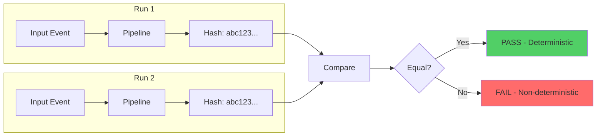

**Verification Command:**
```bash
python run_pipeline.py
sha256sum artifacts/results/case_evt_001.json
# Run again and compare - hashes will match exactly
```

---

## Component Dependencies

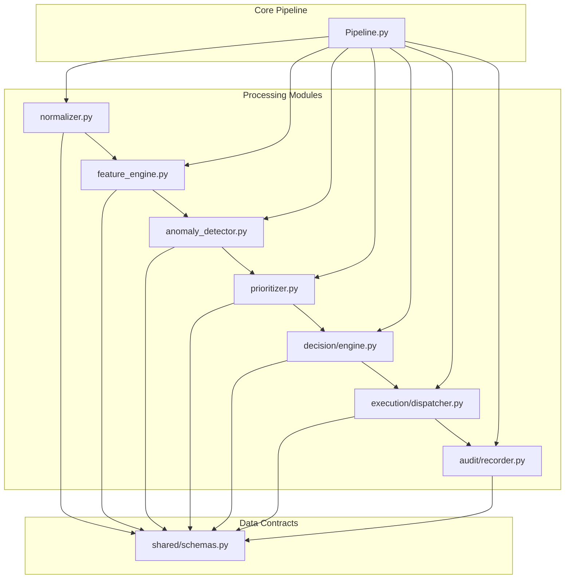

---

## Deployment Architecture

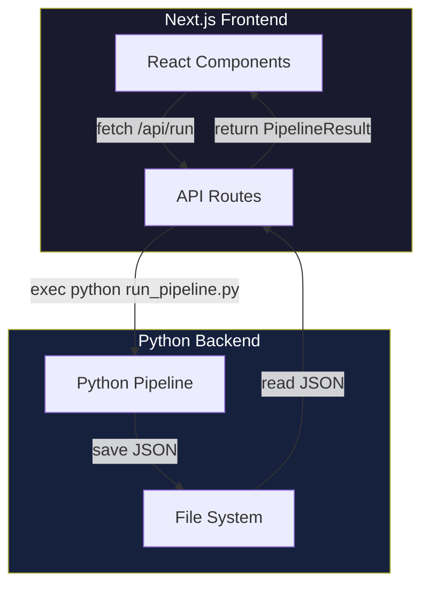

---

## Performance Characteristics

| Operation | Mean Latency | P95 Latency | P99 Latency |
|-----------|-------------|--------------|--------------|
| Feature extraction | 0.0076 ms | 0.009 ms | 0.015 ms |
| Anomaly detection | 0.0070 ms | 0.008 ms | 0.012 ms |
| Decision prioritization | 0.0060 ms | 0.008 ms | 0.010 ms |
| Decision resolution | 0.0011 ms | 0.001 ms | 0.002 ms |
| Audit hashing | 0.0541 ms | 0.060 ms | 0.080 ms |
| **Total pipeline** | **0.076 ms** | **0.101 ms** | **0.645 ms** |

**Throughput:** 13,893 events/second (sustained load)

---

## File Structure

```
Astraea/
├── backend/
│   ├── shared/
│   │   └── schemas.py          # Event, FeatureVector, ModelAssessment, etc.
│   ├── ingestion/
│   │   └── normalizer.py        # Event validation and normalization
│   ├── pipeline/
│   │   └── feature_engine.py    # Threshold analysis, ratio computation
│   ├── ml/
│   │   └── anomaly_detector.py # Scoring with uncertainty quantification
│   ├── decision/
│   │   ├── prioritizer.py      # Priority scoring and routing
│   │   └── engine.py          # Decision resolution
│   ├── execution/
│   │   └── dispatcher.py        # Execution planning
│   ├── audit/
│   │   └── recorder.py        # SHA256 hashing and replay
│   └── core/
│       ├── pipeline.py         # Main orchestrator
│       └── replay.py           # Case replay functionality
├── app/                        # Next.js frontend
│   ├── api/
│   │   ├── cases/route.ts     # GET /api/cases
│   │   ├── run/route.ts       # POST /api/run
│   │   └── replay/route.ts    # POST /api/replay
│   ├── engine/page.tsx        # Deep dive case study
│   └── page.tsx              # Landing page
├── data/
│   └── sample_events.json      # Sample industrial events
├── tests/
│   ├── test_pipeline.py       # Basic pytest tests
│   ├── test_comprehensive.py   # Comprehensive test suite
│   └── test_benchmarks.py     # Performance benchmarks
└── artifacts/
    ├── results/               # Pipeline output JSON
    └── replays/               # Replayable case bundles
```

---

## Key Design Decisions

### 1. Determinism First
Every component uses pure mathematical operations with no side effects. This guarantees bit-exact reproducibility.

### 2. Stage Isolation
Each pipeline stage has clear inputs/outputs, enabling independent testing and modular replacement.

### 3. Audit as First-Class Citizen
Audit recording is built into every stage, not bolted on afterward.

### 4. Uncertainty Quantification
Every prediction includes calibrated confidence intervals, enabling informed human review.

### 5. Operational Routing
Decisions map directly to real-world workflows (maintenance queues, incident response, etc.).
