# Astraea Architecture

## System Overview

Astraea is a deterministic explainable decision engine for event-driven industrial systems. It transforms raw telemetry into auditable, replayable decisions with full uncertainty quantification.

The system consists of a **Next.js frontend**, a thin **Next.js API proxy layer**, a **FastAPI backend** for pipeline execution, and a 7-stage decision pipeline that processes events through ingestion, feature engineering, anomaly detection, prioritization, decision resolution, execution planning, and audit recording. Demo mode exposes both a batch JSON response and an SSE stream so the UI can show a guided walkthrough while the backend runs the real pipeline. The landing page is deliberately split into a **primary flagship narrative** and a collapsible **technical depth** area so product value and diligence can coexist without overwhelming the first impression.

---

## Architecture

### System Architecture Overview

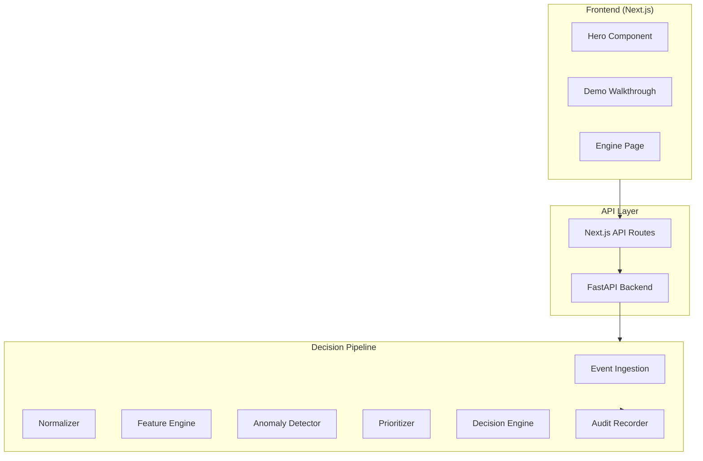
```mermaid
graph TB
    subgraph Frontend["Frontend (Next.js)"]
        Hero["Hero Component"]
        Walkthrough["Demo Walkthrough"]
        Engine["Engine Page"]
    end
    
    subgraph API["API Layer"]
        NAPI["Next.js API Routes"]
        FastAPI["FastAPI Backend"]
    end
    
    subgraph Pipeline["Decision Pipeline"]
        Event["Event Ingestion"]
        Normalize["Normalizer"]
        Feature["Feature Engine"]
        Score["Anomaly Detector"]
        Prioritize["Prioritizer"]
        Decide["Decision Engine"]
        Audit["Audit Recorder"]
    end
    
    Frontend --> NAPI
    NAPI --> FastAPI
    FastAPI --> Pipeline
    Pipeline --> Audit
```

### Data Flow (Streaming)

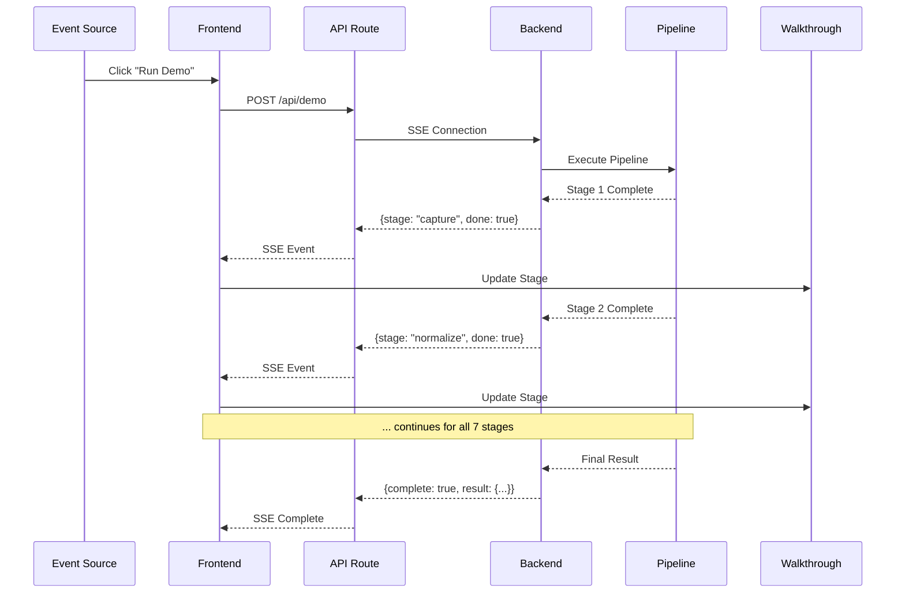
```mermaid
sequenceDiagram
    participant E as Event Source
    participant FE as Frontend
    participant API as API Route
    participant BE as Backend
    participant P as Pipeline
    
    E->>FE: Click "Run Demo"
    FE->>API: POST /api/demo
    API->>BE: SSE Connection
    BE->>P: Execute Pipeline
    P-->>BE: Stage 1 Complete
    BE-->>API: {stage: "capture", done: true}
    API-->>FE: SSE Event
    FE->>Walkthrough: Update Stage
    P-->>BE: Stage 2 Complete
    BE-->>API: {stage: "normalize", done: true}
    API-->>FE: SSE Event
    FE->>Walkthrough: Update Stage
    Note over P,FE: ... continues for all 7 stages
    P-->>BE: Final Result
    BE-->>API: {complete: true, result: {...}}
    API-->>FE: SSE Complete
```

### API Proxy Flow

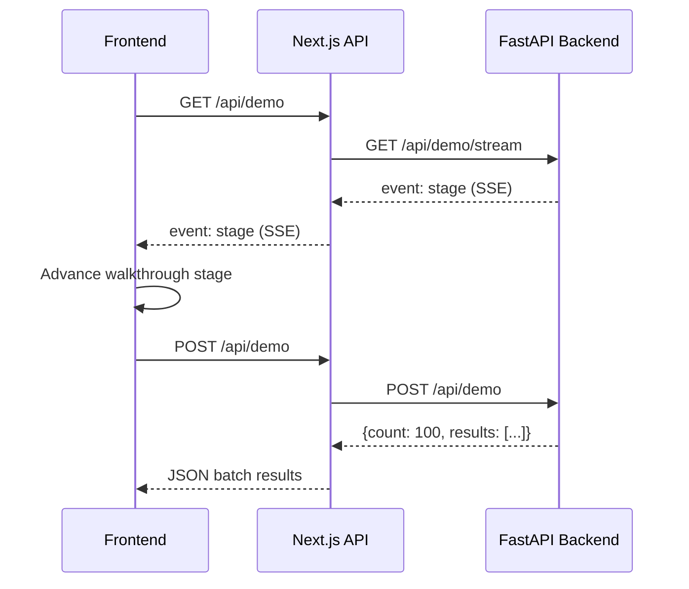
```mermaid
sequenceDiagram
    participant FE as Frontend
    participant NAPI as Next.js API
    participant BE as FastAPI Backend

    FE->>NAPI: GET /api/demo
    NAPI->>BE: GET /api/demo/stream
    BE-->>NAPI: event: stage (SSE)
    NAPI-->>FE: event: stage (SSE)
    FE->>FE: Advance walkthrough stage

    FE->>NAPI: POST /api/demo
    NAPI->>BE: POST /api/demo
    BE-->>NAPI: {count: 100, results: [...]}
    NAPI-->>FE: JSON batch results
```

### Component Hierarchy

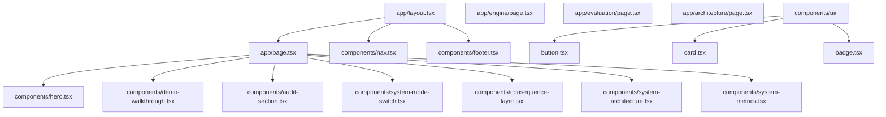
```mermaid
graph TD
    App["app/layout.tsx"]
    Page["app/page.tsx"]
    Hero["components/hero.tsx"]
    Nav["components/nav.tsx"]
    Walkthrough["components/demo-walkthrough.tsx"]
    Audit["components/audit-section.tsx"]
    ModeSwitch["components/system-mode-switch.tsx"]
    Consequence["components/consequence-layer.tsx"]
    ArchView["components/system-architecture.tsx"]
    Metrics["components/system-metrics.tsx"]
    Footer["components/footer.tsx"]

    Engine["app/engine/page.tsx"]
    Eval["app/evaluation/page.tsx"]
    Arch["app/architecture/page.tsx"]

    UI["components/ui/"]
    Button["button.tsx"]
    Card["card.tsx"]
    Badge["badge.tsx"]

    App --> Page
    App --> Nav
    App --> Footer
    Page --> Hero
    Page --> Walkthrough
    Page --> Audit
    Page --> ModeSwitch
    Page --> Consequence
    Page --> ArchView
    Page --> Metrics

    UI --> Button
    UI --> Card
    UI --> Badge
```

### Design System Tokens

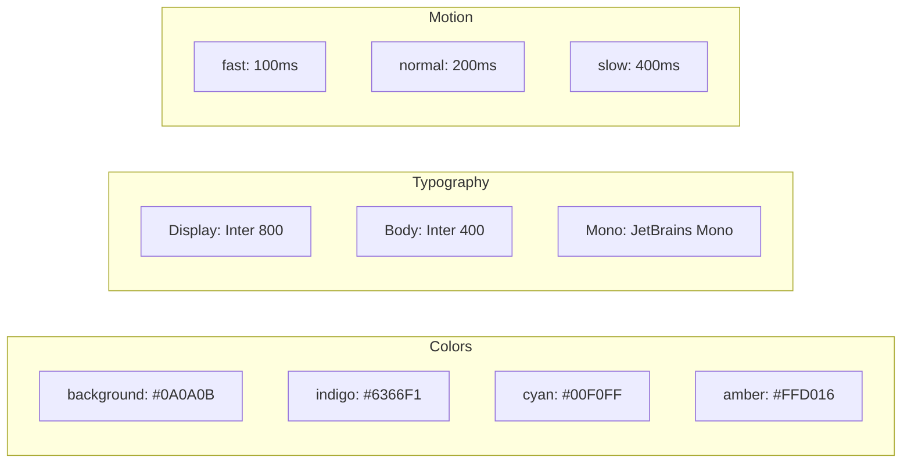
```mermaid
graph LR
    subgraph Colors["Colors"]
        BG["background: #0A0A0B"]
        Primary["indigo: #6366F1"]
        Secondary["cyan: #00F0FF"]
        Accent["amber: #FFD016"]
    end
    
    subgraph Typography["Typography"]
        Display["Display: Inter 800"]
        Body["Body: Inter 400"]
        Mono["Mono: JetBrains Mono"]
    end
    
    subgraph Motion["Motion"]
        Fast["fast: 100ms"]
        Normal["normal: 200ms"]
        Slow["slow: 400ms"]
    end
```

---

## Frontend

### Overview

The **Next.js frontend** provides a reactive user interface for interacting with the Astraea decision engine. It features real-time streaming updates via Server-Sent Events (SSE), a demo walkthrough component, and an engine page for deep-dive case analysis.

### Design System

**Color Palette:**
| Token | Value | Usage |
|-------|-------|-------|
| `background` | `#0A0A0B` | Page background |
| `foreground` | `#FAFAFA` | Primary text |
| `indigo` | `#6366F1` | Primary actions, links |
| `cyan` | `#00F0FF` | Secondary highlights |
| `amber` | `#FFD016` | Accent, warnings |
| `muted` | `#27272A` | Card backgrounds |

**Typography:**
- **Display:** Inter 800 (headings)
- **Body:** Inter 400 (paragraphs)
- **Mono:** JetBrains Mono (code, metrics)

**Motion:**
- `fast`: 100ms (micro-interactions)
- `normal`: 200ms (standard transitions)
- `slow`: 400ms (page transitions, reveals)

### UI Components

The component library is located in `components/ui/`:

| Component | File | Description |
|-----------|------|-------------|
| Button | `button.tsx` | Primary, secondary, ghost variants |
| Card | `card.tsx` | Content containers with hover states |
| Badge | `badge.tsx` | Status indicators (critical, high, medium, low) |
| Skeleton | `skeleton.tsx` | Loading placeholders with shimmer |
| Input | `input.tsx` | Text inputs with focus and error states |

### Key Components

- **`Hero Component`** (`components/hero.tsx`): Main landing hero with CTA
- **`Demo Walkthrough`** (`components/demo-walkthrough.tsx`): 7-stage streaming demo with real-time pipeline visualization
- **`Audit Section`** (`components/audit-section.tsx`): Proof-oriented trust layer that explains replay and hash verification
- **`Artifacts Section`** (`components/artifacts-section.tsx`): Product-layer framing for frontend, backend, and replay artifacts
- **`Engine Page`** (`app/engine/page.tsx`): Deep-dive case study interface with case queue
- **`Technical Depth Drawer`** (`app/page.tsx`): Secondary architecture views kept behind a collapsible detail surface

---

## Backend

### FastAPI Integration

The **FastAPI backend** serves as the primary API layer, handling:
- SSE (Server-Sent Events) streaming for real-time pipeline updates
- REST endpoints for case retrieval and replay
- Python pipeline execution management
- Batch demo execution for 100 synthetic events

The `/api/cases` endpoint merges both live run artifacts and demo artifacts so the engine page can inspect the latest replayable decision bundles without caring which mode produced them.

### Repository Guardrails

The repository now protects itself at both the **local commit** and **CI** layers:

- **Local pre-commit blocking** via `.githooks/pre-commit`
- **Repository-wide secret scan** via `.github/workflows/ci.yml`
- **Example-only secrets** kept in `.env.example` instead of committed runtime files

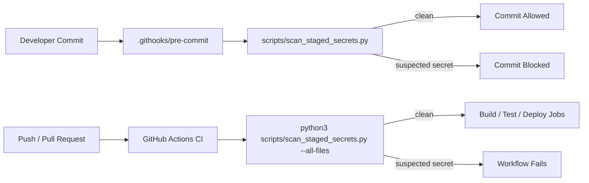
```mermaid
flowchart LR
    Dev["Developer Commit"] --> Hook[".githooks/pre-commit"]
    Hook --> Scan["scripts/scan_staged_secrets.py"]
    Scan -->|clean| Commit["Commit Allowed"]
    Scan -->|suspected secret| Block["Commit Blocked"]

    Push["Push / Pull Request"] --> CI["GitHub Actions CI"]
    CI --> RepoScan["python3 scripts/scan_staged_secrets.py --all-files"]
    RepoScan -->|clean| Jobs["Build / Test / Deploy Jobs"]
    RepoScan -->|suspected secret| Fail["Workflow Fails"]
```

### Production Deploy Path

The production deployment path now creates **runtime Kubernetes secrets from CI** instead of applying the placeholder secret manifest from the repository.

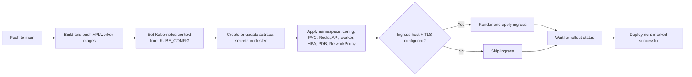
```mermaid
flowchart LR
    Push["Push to main"] --> Build["Build and push API/worker images"]
    Build --> Context["Set Kubernetes context from KUBE_CONFIG"]
    Context --> Secret["Create or update astraea-secrets in cluster"]
    Secret --> Deploy["Apply namespace, config, PVC, Redis, API, worker, HPA, PDB, NetworkPolicy"]
    Deploy --> Ingress{"Ingress host + TLS configured?"}
    Ingress -->|Yes| ApplyIngress["Render and apply ingress"]
    Ingress -->|No| SkipIngress["Skip ingress"]
    ApplyIngress --> Verify["Wait for rollout status"]
    SkipIngress --> Verify["Wait for rollout status"]
    Verify --> Healthy["Deployment marked successful"]
```

### Streaming Architecture

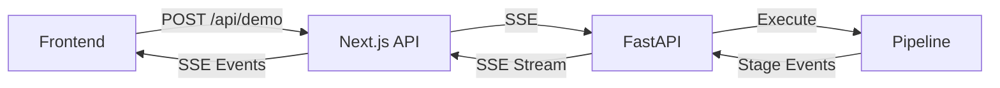
```mermaid
graph LR
    FE[Frontend] -->|POST /api/demo| NAPI[Next.js API]
    NAPI -->|SSE| BE[FastAPI]
    BE -->|Execute| PL[Pipeline]
    PL -->|Stage Events| BE
    BE -->|SSE Stream| NAPI
    NAPI -->|SSE Events| FE
```

### API Endpoints

| Method | Endpoint | Description |
|--------|----------|-------------|
| `GET` | `/health` | Basic health check with uptime and DB status |
| `POST` | `/api/run` | Execute pipeline on sample events |
| `POST` | `/api/demo` | Run 100-event demo batch with graph context |
| `GET` | `/api/demo/stream` | SSE stream for seven-stage pipeline |
| `GET` | `/api/cases` | List all pipeline results |
| `GET` | `/api/cases/{case_id}` | Retrieve one full case |
| `POST` | `/api/replay` | Replay verification by request body |
| `POST` | `/api/replay/{case_id}` | Re-execute stored event and compare hashes |
| `GET` | `/api/claims` | Claim-to-proof matrix |
| `GET` | `/api/evaluation/latest` | Latest evaluation artifact |
| `GET` | `/api/health/deep` | Runtime health, artifact, DB, Floci status |
| `POST` | `/api/v1/ingest/events` | Ingest and process event list |
| `POST` | `/api/v1/ingest/batch` | Batch ingest with job tracking |
| `GET` | `/api/v1/jobs/{job_id}` | Check async job status |
| `GET` | `/api/v1/cases` | Filtered case listing with pagination |
| `POST` | `/api/v1/replay/{case_id}/verify` | Verify replay for a case |
| `GET` | `/api/v1/observability/metrics` | Pipeline and artifact metrics |
| `GET` | `/api/v1/observability/health` | Versioned health check |
| `GET` | `/api/v1/observability/benchmarks` | Benchmark view from eval artifact |
| `POST` | `/auth/register` | Register new user |
| `POST` | `/auth/token` | Login, get JWT |
| `GET` | `/auth/me` | Current user profile |

---

## Data Flow

### Streaming Pipeline Flow

The demo walkthrough implements a 7-stage streaming architecture:

1. **Capture** - Event ingestion from sensor data
2. **Normalize** - Validate and normalize raw values
3. **Feature** - Compute feature vectors
4. **Score** - Anomaly detection with uncertainty
5. **Prioritize** - Calculate priority scores
6. **Decide** - Resolve routing bucket
7. **Audit** - Final result with audit hash

The batch demo processes 100 synthetic events by default and stores the resulting cases as JSON artifacts for replay.

Each stage emits an SSE event to the frontend for real-time UI updates.

### Batch Processing Flow

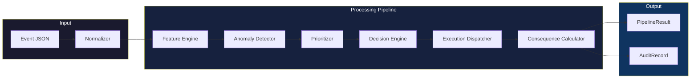
```mermaid
flowchart LR
    subgraph INPUT["Input"]
        E1[Event JSON] --> N[Normalizer]
    end

    subgraph PROCESSING["Processing Pipeline"]
        N --> FE[Feature Engine]
        FE --> AD[Anomaly Detector]
        AD --> PE[Prioritizer]
        PE --> DE[Decision Engine]
        DE --> ED[Execution Dispatcher]
        ED --> CC[Consequence Calculator]
    end

    subgraph OUTPUT["Output"]
        CC --> P[PipelineResult]
        CC --> A[AuditRecord]
    end

    style INPUT fill:#1a1a2e,color:#fff
    style PROCESSING fill:#16213e,color:#fff
    style OUTPUT fill:#0f3460,color:#fff
```

---

## Pipeline Stage Details

### Stage 1: Event Ingestion

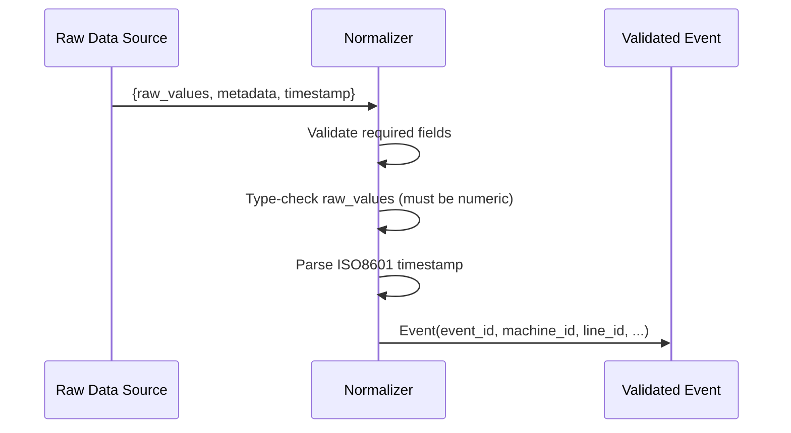
```mermaid
sequenceDiagram
    participant Sensor as Raw Data Source
    participant Norm as Normalizer
    participant Event as Validated Event

    Sensor->>Norm: {raw_values, metadata, timestamp}
    Norm->>Norm: Validate required fields
    Norm->>Norm: Type-check raw_values (must be numeric)
    Norm->>Norm: Parse ISO8601 timestamp
    Norm->>Event: Event(event_id, machine_id, line_id, ...)
```

**Responsibilities:**
- Validate all required fields exist
- Ensure `raw_values` are numeric (float)
- Parse ISO8601 timestamps with timezone support
- Normalize metadata structure

---

### Stage 2: Feature Engineering

```mermaid
flowchart TD
    A[Raw Values] --> B{For each metric}
    B -->|Yes| C[raw_{key}]
    B -->|Yes| D[delta_{key}]
    B -->|Yes| E[ratio_{key}]
    B -->|Yes| F[{key}_above_threshold]
    C --> G[FeatureVector]
    D --> G
    E --> G
    F --> G
    B -->|No| H[Next metric]
    
    G --> I[ratio_max]
    G --> J[ratio_mean]
    G --> K[delta_max]
    G --> L[delta_mean]
```

**Thresholds Configuration:**
```python
THRESHOLDS = {
    "vibration_rms": 8.0,    # mm/s
    "vibration_peak": 20.0,  # mm/s
    "temperature_c": 85.0,    # Celsius
    "current_amps": 20.0,    # Amperes
    "rpm": 1200.0,           # Revolutions/min
}
```

**Event Baselines:**
```python
EVENT_BASELINES = {
    "vibration_spike": 0.90,
    "temperature_rise": 0.75,
    "stoppage": 0.95,
    "current_surge": 0.70,
    "pressure_anomaly": 0.80,
}
```

---

### Stage 3: Anomaly Detection

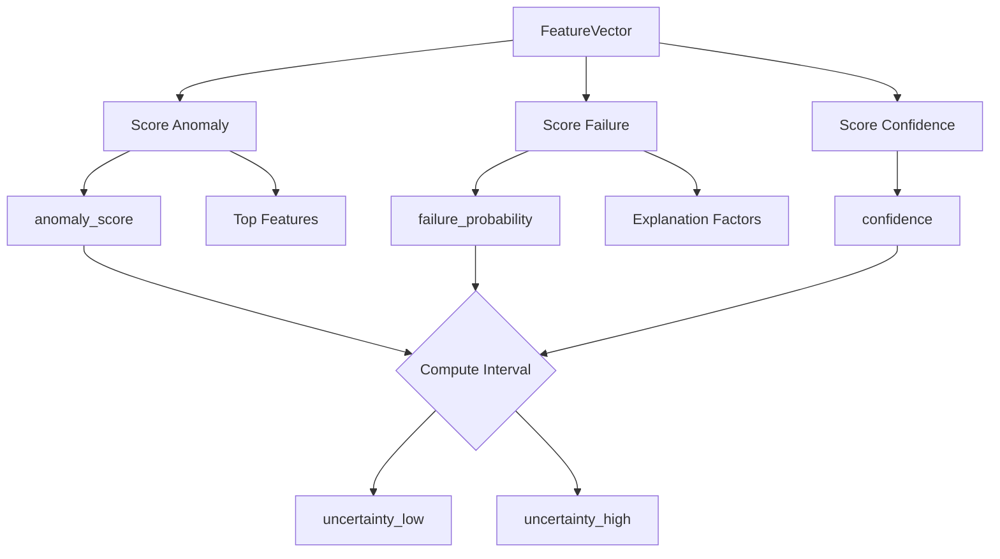
```mermaid
flowchart TD
    A[FeatureVector] --> B[Score Anomaly]
    A --> C[Score Failure]
    A --> D[Score Confidence]

    B --> E[anomaly_score]
    C --> F[failure_probability]
    D --> G[confidence]

    E --> H{Compute Interval}
    F --> H
    G --> H

    H --> I[uncertainty_low]
    H --> J[uncertainty_high]

    B --> K[Top Features]
    C --> L[Explanation Factors]
```

**Scoring Formulas:**

```python
# Anomaly Score
anomaly_score = (
    0.45 * threshold_component +
    0.35 * event_bias +
    duration_bonus +
    ratio_bonus
)

# Failure Probability
failure_probability = (
    0.45 * ratio_factor +
    0.35 * delta_factor +
    0.20 * duration_factor
)

# Confidence
confidence = (
    0.65 * top_signal +
    source_bonus +
    consistency_bonus
)
```

---

### Stage 4: Decision Prioritization

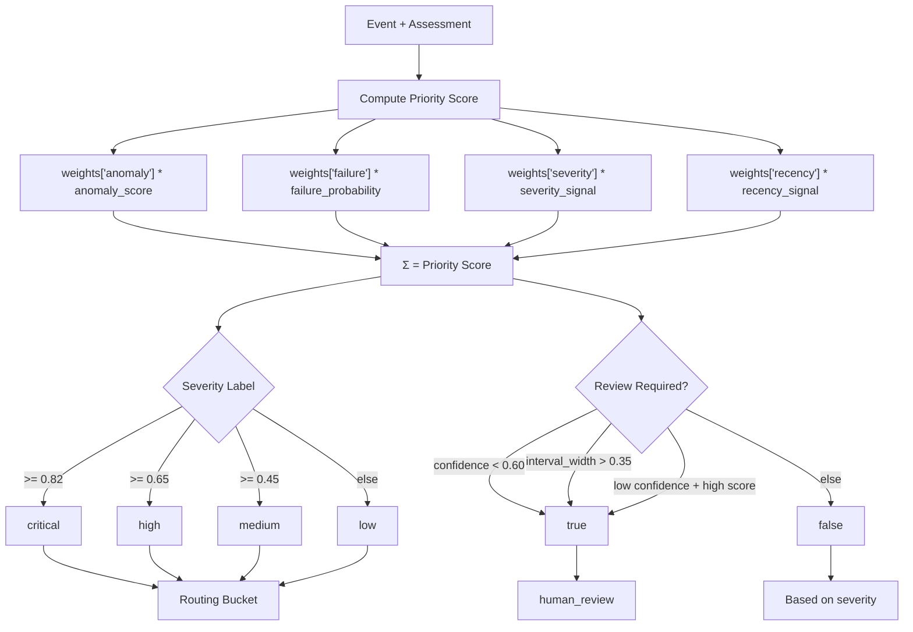
```mermaid
flowchart TD
    A[Event + Assessment] --> B[Compute Priority Score]

    B --> C["weights['anomaly'] * anomaly_score"]
    B --> D["weights['failure'] * failure_probability"]
    B --> E["weights['severity'] * severity_signal"]
    B --> F["weights['recency'] * recency_signal"]

    C --> G[Σ = Priority Score]
    D --> G
    E --> G
    F --> G

    G --> H{Severity Label}
    H -->|>= 0.82| I[critical]
    H -->|>= 0.65| J[high]
    H -->|>= 0.45| K[medium]
    H -->|else| L[low]

    G --> M{Review Required?}
    M -->|confidence < 0.60| N[true]
    M -->|interval_width > 0.35| N
    M -->|low confidence + high score| N
    M -->|else| O[false]

    I --> P[Routing Bucket]
    J --> P
    K --> P
    L --> P

    N --> Q[human_review]
    O --> R[Based on severity]
```

**Priority Weights:**
```python
weights = {
    "anomaly": 0.30,      # Primary signal weight
    "failure": 0.25,      # Secondary signal weight
    "severity": 0.15,     # Event type baseline
    "recency": 0.08,      # Time decay factor
    "temporal": 0.10,     # Temporal trend signal
    "correlation": 0.07,  # Cross-event correlation
    "velocity": 0.05,     # Event rate signal
}
```

---

### Stage 5: Decision Resolution

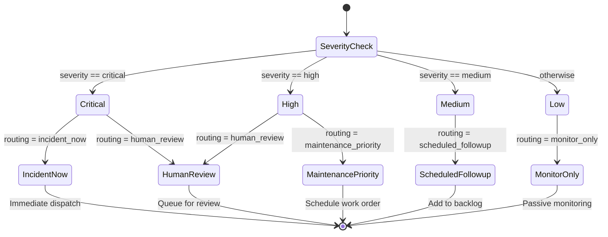
```mermaid
stateDiagram-v2
    [*] --> SeverityCheck
    SeverityCheck --> Critical: severity == critical
    SeverityCheck --> High: severity == high
    SeverityCheck --> Medium: severity == medium
    SeverityCheck --> Low: otherwise
    
    Critical --> IncidentNow: routing = incident_now
    Critical --> HumanReview: routing = human_review
    
    High --> MaintenancePriority: routing = maintenance_priority
    High --> HumanReview: routing = human_review
    
    Medium --> ScheduledFollowup: routing = scheduled_followup
    
    Low --> MonitorOnly: routing = monitor_only
    
    IncidentNow --> [*]: Immediate dispatch
    HumanReview --> [*]: Queue for review
    MaintenancePriority --> [*]: Schedule work order
    ScheduledFollowup --> [*]: Add to backlog
    MonitorOnly --> [*]: Passive monitoring
```

---

### Stage 6: Execution Planning

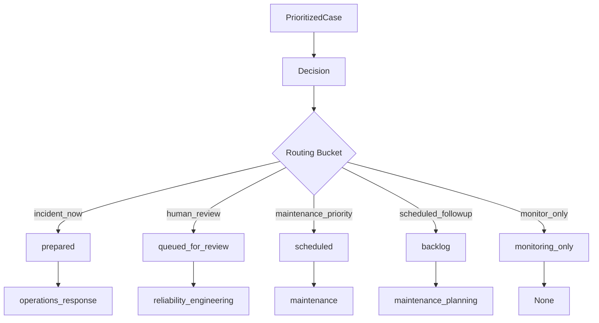
```mermaid
flowchart TD
    A[PrioritizedCase] --> B[Decision]

    B --> C{Routing Bucket}
    C -->|incident_now| D[prepared]
    C -->|human_review| E[queued_for_review]
    C -->|maintenance_priority| F[scheduled]
    C -->|scheduled_followup| G[backlog]
    C -->|monitor_only| H[monitoring_only]

    D --> I[operations_response]
    E --> J[reliability_engineering]
    F --> K[maintenance]
    G --> L[maintenance_planning]
    H --> M[None]
```

---

### Stage 7: Audit Recording

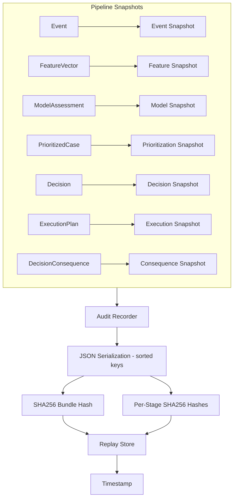
```mermaid
flowchart TD
    subgraph SNAPSHOTS["Pipeline Snapshots"]
        A[Event] --> B[Event Snapshot]
        C[FeatureVector] --> D[Feature Snapshot]
        E[ModelAssessment] --> F[Model Snapshot]
        G[PrioritizedCase] --> H[Prioritization Snapshot]
        I[Decision] --> J[Decision Snapshot]
        K[ExecutionPlan] --> L[Execution Snapshot]
        M2[DecisionConsequence] --> N2[Consequence Snapshot]
    end

    SNAPSHOTS --> M[Audit Recorder]

    M --> O[JSON Serialization - sorted keys]
    O --> Q[SHA256 Bundle Hash]
    O --> R[Per-Stage SHA256 Hashes]

    Q --> S[Replay Store]
    R --> S
    S --> T[Timestamp]
```

---

## Uncertainty Quantification Model

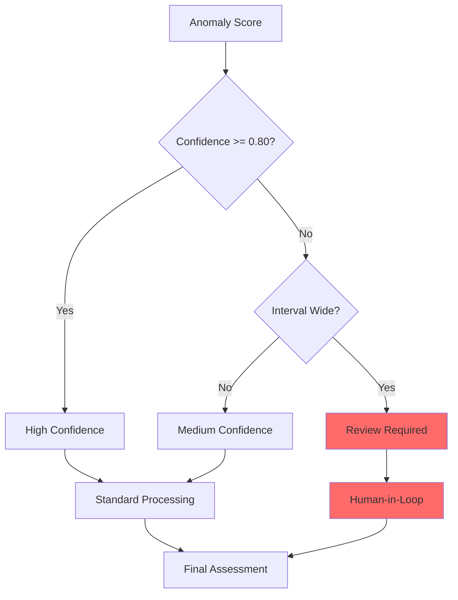
```mermaid
flowchart TD
    A[Anomaly Score] --> B{Confidence >= 0.80?}
    
    B -->|Yes| C[High Confidence]
    B -->|No| D{Interval Wide?}
    
    C --> E[Standard Processing]
    D -->|Yes| F[Review Required]
    D -->|No| G[Medium Confidence]
    
    F --> H[Human-in-Loop]
    G --> E
    
    E --> I[Final Assessment]
    H --> I
    
    style F fill:#ff6b6b
    style H fill:#ff6b6b
```

**Uncertainty Interval Computation:**
```python
spread = max(0.05, 0.30 * (1.0 - confidence))
low = max(0.0, anomaly_score - spread)
high = min(1.0, anomaly_score + spread)
```

---

## Routing Bucket System

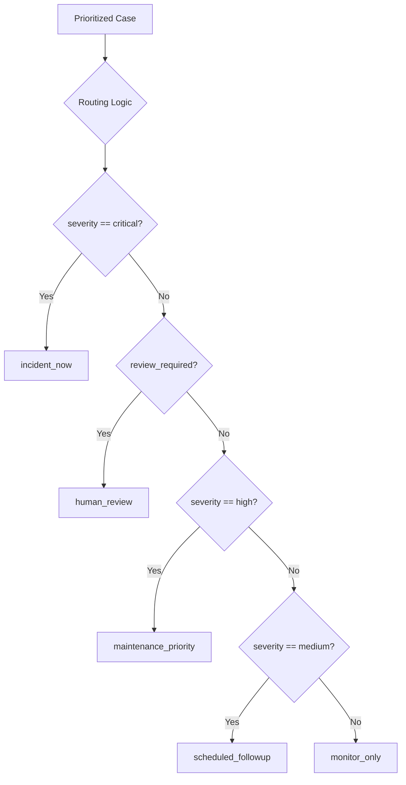
```mermaid
flowchart TD
    A[Prioritized Case] --> B{Routing Logic}
    
    B --> C{severity == critical?}
    C -->|Yes| D[incident_now]
    C -->|No| E{review_required?}
    
    E -->|Yes| F[human_review]
    E -->|No| G{severity == high?}
    
    G -->|Yes| H[maintenance_priority]
    G -->|No| I{severity == medium?}
    
    I -->|Yes| J[scheduled_followup]
    I -->|No| K[monitor_only]
```

| Bucket | Severity | Action | Team |
|--------|----------|--------|------|
| `incident_now` | critical | Immediate dispatch | operations_response |
| `human_review` | any (review flag) | Queue for review | reliability_engineering |
| `maintenance_priority` | high | Schedule work order | maintenance |
| `scheduled_followup` | medium | Add to backlog | maintenance_planning |
| `monitor_only` | low | Passive monitoring | None |

---

## Determinism Guarantee

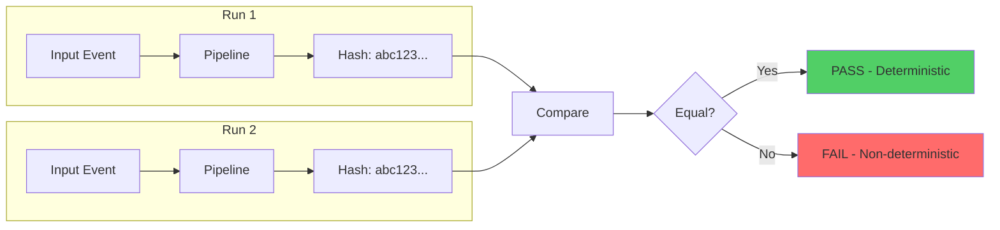
```mermaid
flowchart LR
    subgraph RUN1["Run 1"]
        A1[Input Event] --> P1[Pipeline]
        P1 --> H1[Hash: abc123...]
    end

    subgraph RUN2["Run 2"]
        A2[Input Event] --> P2[Pipeline]
        P2 --> H2[Hash: abc123...]
    end

    H1 --> E[Compare]
    H2 --> E

    E --> R{Equal?}
    R -->|Yes| P[PASS - Deterministic]
    R -->|No| F[FAIL - Non-deterministic]

    style P fill:#51cf66
    style F fill:#ff6b6b
```

**Verification Command:**
```bash
python run_pipeline.py
sha256sum artifacts/results/case_evt_001.json
# Run again and compare - hashes will match exactly
```

---

## Component Dependencies

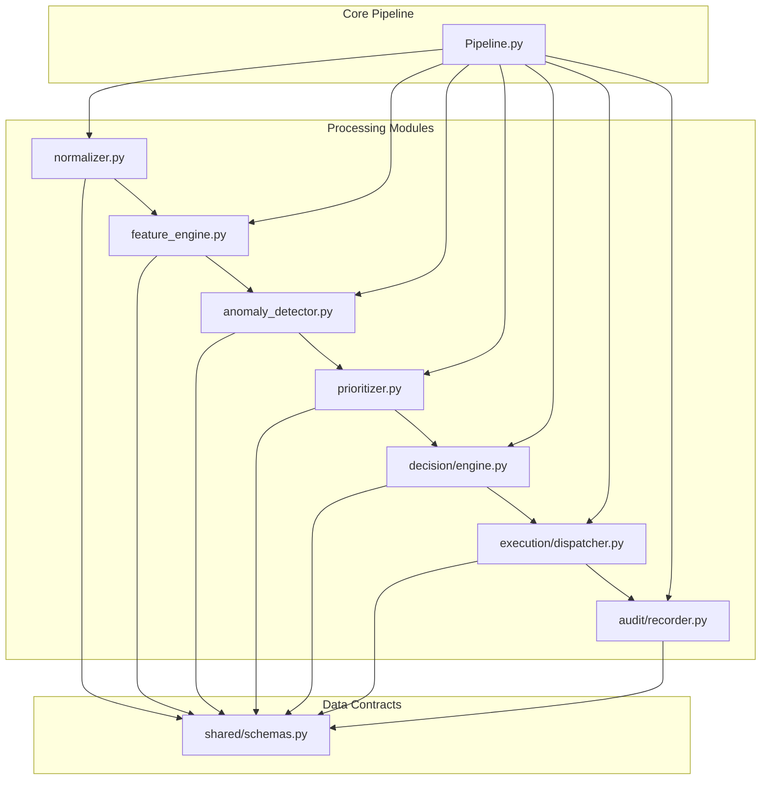
```mermaid
flowchart TD
    subgraph CORE["Core Pipeline"]
        P[Pipeline.py]
    end

    subgraph MODULES["Processing Modules"]
        N[normalizer.py]
        F[feature_engine.py]
        A[anomaly_detector.py]
        DP[prioritizer.py]
        DE[decision/engine.py]
        ED[execution/dispatcher.py]
        AR[audit/recorder.py]
    end

    subgraph SCHEMAS["Data Contracts"]
        S[shared/schemas.py]
    end

    N --> F
    F --> A
    A --> DP
    DP --> DE
    DE --> ED
    ED --> AR

    P --> N
    P --> F
    P --> A
    P --> DP
    P --> DE
    P --> ED
    P --> AR

    N --> S
    F --> S
    A --> S
    DP --> S
    DE --> S
    ED --> S
    AR --> S
```

---

## Deployment Architecture

```mermaid
flowchart TB
    subgraph FRONTEND["Next.js Frontend"]
        UI[React Components]
        API[API Routes]
        SSE[SSE Streaming]
    end

    subgraph BACKEND["FastAPI Backend"]
        PL[Python Pipeline]
        FS[File System]
    end

    UI -->|fetch /api/demo| API
    API -->|SSE| FE
    API -->|exec pipeline| PL
    PL -->|save JSON| FS
    FS -->|read JSON| API
    API -->|return result| UI

    style FRONTEND fill:#1a1a2e,color:#fff
    style BACKEND fill:#16213e,color:#fff
```

---

## Performance Characteristics

From the latest synthetic evaluation (500 cases, `generated_labeled_synthetic_v1`):

| Metric | Value |
|--------|-------|
| Throughput | 6,160 events/sec |
| Mean latency | 0.1623 ms |
| P99 latency | 0.2469 ms |
| Hash consistency | 100.00% |
| Replay pass rate | 100.00% |
| Audit completeness | 100.00% |
| Rationale coverage | 100.00% |

Baseline comparison:

| System | Precision | Recall | Accuracy | False Escalation |
|--------|-----------|--------|----------|------------------|
| Threshold only | 62.50% | 100.00% | 70.00% | 60.00% |
| Scoring only | 83.33% | 100.00% | 90.00% | 20.00% |
| Frozen model | 100.00% | 100.00% | 100.00% | 0.00% |
| Astraea | 100.00% | 100.00% | 100.00% | 0.00% |

These are synthetic benchmarks, not production plant throughput claims.

---

## File Structure

```
Astraea/
├── backend/
│   ├── api/
│   │   ├── main.py              # FastAPI endpoints (v0 + v1)
│   │   └── middleware.py        # CORS, rate limiting
│   ├── shared/
│   │   └── schemas.py           # Event, FeatureVector, ModelAssessment, etc.
│   ├── ingestion/
│   │   └── normalizer.py        # Event validation and normalization
│   ├── ml/
│   │   ├── anomaly_detector.py  # Scoring with uncertainty quantification
│   │   └── model.py             # Frozen logistic model training/loading
│   ├── decision/
│   │   ├── prioritizer.py       # Ensemble scoring and routing
│   │   └── engine.py            # Decision resolution
│   ├── execution/
│   │   ├── dispatcher.py        # Execution planning
│   │   └── consequence.py       # Business impact estimation
│   ├── audit/
│   │   └── recorder.py          # SHA256 hashing and replay
│   ├── reasoning/
│   │   ├── graph.py             # Graph-lite reasoning engine
│   │   └── multi_event.py       # Multi-event correlation
│   ├── evaluation/
│   │   └── run_eval.py          # Synthetic evaluation harness
│   ├── core/
│   │   ├── pipeline.py          # Main orchestrator
│   │   ├── replay_engine.py     # True replay re-execution
│   │   ├── replay.py            # Case persistence
│   │   ├── config.py            # Pydantic settings
│   │   ├── floci.py             # Optional local cloud emulation
│   │   └── retention.py         # Artifact lifecycle management
│   ├── auth/
│   │   ├── routes.py            # JWT auth endpoints
│   │   ├── models.py            # User model
│   │   └── security.py          # Password hashing, JWT
│   └── db/
│       ├── models.py            # SQLAlchemy models
│       ├── crud.py              # Database operations
│       └── session.py           # DB session management
├── app/                         # Next.js frontend
│   ├── page.tsx                 # Landing proof console
│   ├── engine/page.tsx          # Inspection cockpit
│   ├── evaluation/page.tsx      # Claim matrix and benchmarks
│   ├── architecture/page.tsx    # Topology and health
│   └── api/                     # Next.js API proxy routes
├── components/
│   ├── hero.tsx                 # Main hero with SSE streaming
│   ├── nav.tsx                  # Navigation
│   ├── demo-walkthrough.tsx     # 7-stage streaming demo
│   ├── audit-section.tsx        # Replay verification panel
│   ├── system-mode-switch.tsx   # Operating stances
│   ├── consequence-layer.tsx    # Business impact framing
│   ├── system-architecture.tsx  # Interactive topology
│   ├── system-metrics.tsx       # Metrics display
│   └── footer.tsx               # Footer
├── lib/
│   └── data.ts                  # Frontend data contracts
├── data/
│   ├── sample_events.json       # Sample industrial events
│   └── synthetic_events_100.json # 100-event demo batch
├── tests/
│   ├── test_pipeline.py         # Core pipeline tests
│   ├── test_platform.py         # Platform integration tests
│   └── test_public_demo_endpoints.py
├── artifacts/
│   ├── results/                 # Pipeline output JSON
│   ├── replays/                 # Replayable case bundles
│   ├── evaluation/              # Eval artifacts (eval_latest.json)
│   └── model/                   # Frozen model artifact
├── k8s/                         # Kubernetes manifests
├── docs/
│   ├── CLAIM_MATRIX.md          # Claim-to-proof spine
│   ├── MODEL_CARD.md            # Frozen model card
│   └── ASTRAEA_PAPER.md         # Research paper
└── .github/workflows/
    ├── ci.yml                   # CI pipeline
    └── deploy.yml               # K8s deploy (manual trigger)
```

---

## Key Design Decisions

### 1. Determinism First
Every component uses pure mathematical operations with no side effects. This guarantees bit-exact reproducibility.

### 2. Stage Isolation
Each pipeline stage has clear inputs/outputs, enabling independent testing and modular replacement.

### 3. Audit as First-Class Citizen
Audit recording is built into every stage, not bolted on afterward.

### 4. Uncertainty Quantification
Every prediction includes calibrated confidence intervals, enabling informed human review.

### 5. Operational Routing
Decisions map directly to real-world workflows (maintenance queues, incident response, etc.).

### 6. Real-Time Streaming
SSE enables real-time pipeline stage updates for enhanced user experience during demo execution.

(End of file - total 712 lines)
