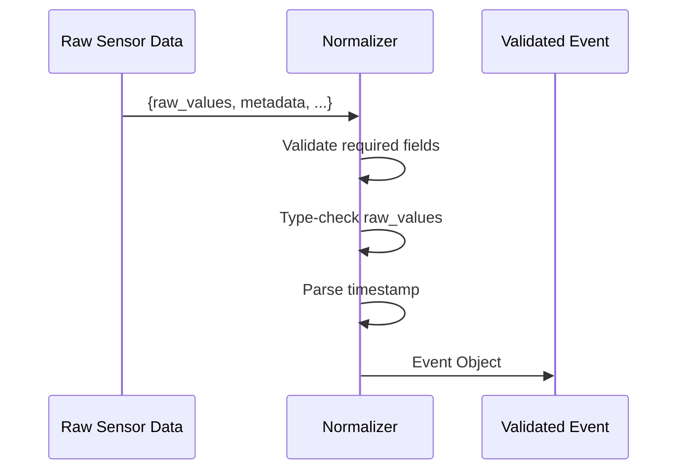
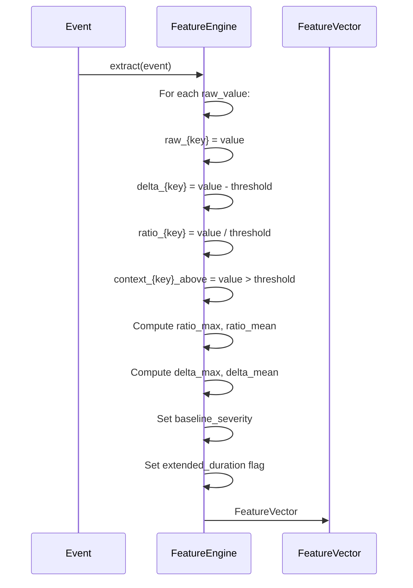
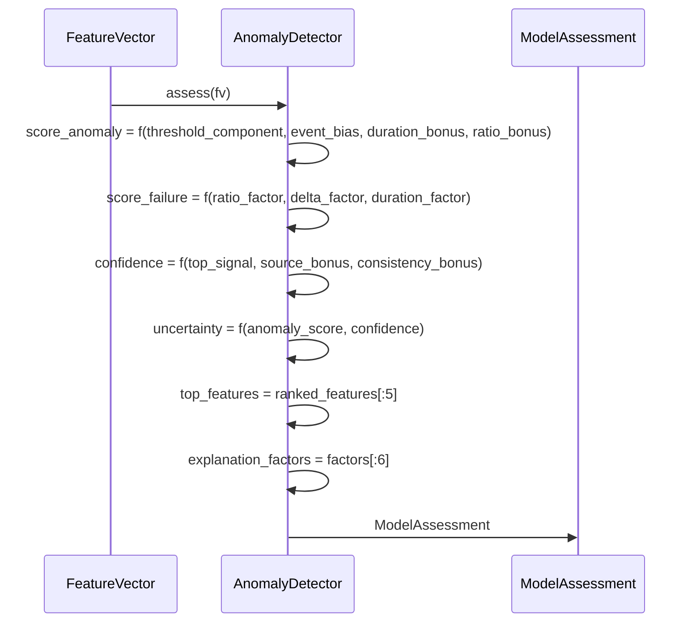
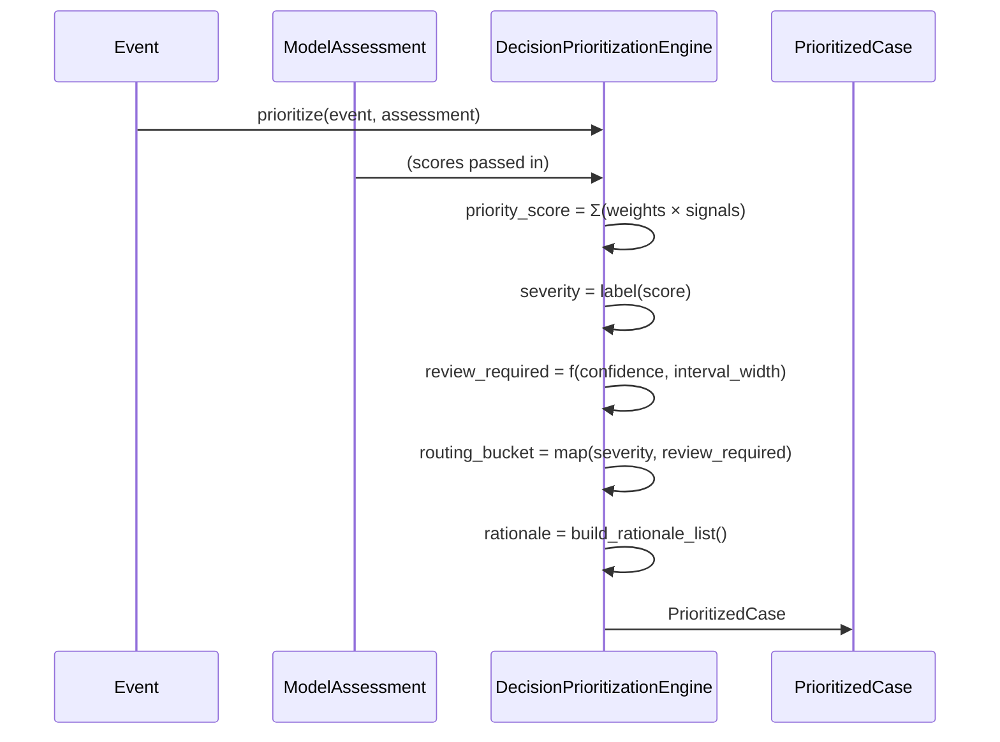
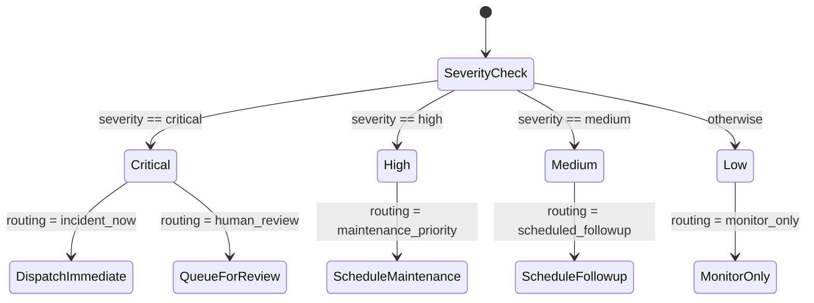
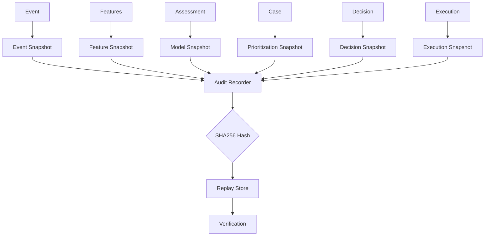

# Astraea Architecture

## System Design Principles

### 1. Determinism First

Every component in Astraea is designed to be deterministic:

```
Input A → System → Output B (always)
Input A → System → Output B (identical)
```

**Implications:**
- No timestamps used in scoring (except for recency weighting)
- Fixed threshold values from configuration
- Pure mathematical operations with no side effects
- Reproducible hash verification at every stage

### 2. Pipeline Stage Isolation

Each pipeline stage is isolated with clear inputs/outputs:

```
Stage N-1 Output → Stage N Input
Stage N Output → Stage N+1 Input
```

**Benefits:**
- Easy to debug individual stages
- Independent testability
- Clear error propagation
- Modular replacement capability

### 3. Audit as a First-Class Citizen

Audit recording is not an afterthought — it's built into every stage:

```
Every Stage → Snapshot → Hash Contribution
All Snapshots → Deterministic Hash
```

---

## Component Architecture

### Backend Structure

```
backend/
├── shared/
│   └── schemas.py          # Data contracts (Event, FeatureVector, etc.)
├── ingestion/
│   └── normalizer.py       # Event validation and normalization
├── pipeline/
│   └── feature_engine.py   # Feature extraction from raw telemetry
├── ml/
│   └── anomaly_detector.py  # Scoring with uncertainty quantification
├── decision/
│   ├── prioritizer.py      # Priority scoring and routing
│   └── engine.py           # Decision resolution and action mapping
├── execution/
│   └── dispatcher.py        # Execution planning and team assignment
├── audit/
│   └── recorder.py         # Snapshot collection and hash generation
└── core/
    ├── pipeline.py          # Main orchestrator
    └── replay.py            # Case replay functionality
```

### Frontend Structure

```
app/
├── page.tsx                 # Landing page with live demo
├── layout.tsx               # Root layout with fonts
├── globals.css              # Global styles + custom properties
├── engine/
│   └── page.tsx            # Deep dive case study page
└── api/
    ├── cases/
    │   └── route.ts         # GET /api/cases
    ├── run/
    │   └── route.ts         # POST /api/run
    └── replay/
        └── route.ts         # POST /api/replay

components/
├── nav.tsx                  # Navigation bar
├── hero.tsx                 # Hero section with live pipeline
├── scroll-narrative.tsx      # Pipeline explanation
├── audit-section.tsx        # Audit/trace section
├── artifacts-section.tsx     # System modules
├── footer.tsx               # Footer
├── cursor-glow.tsx          # Interactive cursor effect
├── system-side-rail.tsx     # Side navigation
├── pipeline-visualizer.tsx   # Visual pipeline trace
├── decision-breakdown.tsx   # Decision explanation
└── audit-visualization.tsx   # Audit trail visualization
```

---

## Data Flow

### Event Ingestion



**Normalizer Responsibilities:**
1. Validate all required fields exist
2. Ensure `raw_values` are numeric
3. Parse ISO8601 timestamps
4. Normalize metadata structure

### Feature Engineering



### Anomaly Detection



**Scoring Formula:**
```
anomaly_score = 0.45 × threshold_component
              + 0.35 × event_bias
              + duration_bonus
              + ratio_bonus

failure_probability = 0.45 × ratio_factor
                    + 0.35 × delta_factor
                    + 0.20 × duration_factor

confidence = 0.65 × top_signal
           + source_bonus
           + consistency_bonus
```

### Decision Prioritization



**Priority Weights:**
```python
weights = {
    "anomaly": 0.38,      # Primary signal
    "failure": 0.30,      # Secondary signal
    "severity": 0.22,     # Event type baseline
    "recency": 0.10,      # Time decay
}
```

### Decision Resolution



### Audit Recording



---

## Deployment Architecture

### Local Development

```
┌─────────────────────────────────────┐
│          Next.js Frontend            │
│         localhost:3000               │
│                                     │
│  ┌─────────────────────────────┐   │
│  │       React Components       │   │
│  │  Hero / Pipeline / Audit     │   │
│  └─────────────────────────────┘   │
└──────────────┬──────────────────────┘
               │ HTTP
               ▼
┌─────────────────────────────────────┐
│          Python Backend              │
│                                     │
│  ┌─────────────────────────────┐   │
│  │     API Routes              │   │
│  │  /api/cases  /api/run       │   │
│  └─────────────────────────────┘   │
│               │                     │
│  ┌─────────────────────────────┐   │
│  │    AstraeaPipeline           │   │
│  │  Event → Decision → Audit   │   │
│  └─────────────────────────────┘   │
└─────────────────────────────────────┘
```

### Production Considerations

For production deployment:

1. **API Routes** should call Python as subprocess or via socket
2. **Replay Store** should use distributed filesystem or object storage
3. **Pipeline** should be containerized with Docker
4. **State** should be managed via Redis or similar for scaling

---

## Performance Characteristics

| Operation | Latency | Notes |
|-----------|---------|-------|
| Event normalization | < 1ms | Simple type casting |
| Feature extraction | < 2ms | O(n) threshold checks |
| Anomaly scoring | < 1ms | Pure computation |
| Decision prioritization | < 1ms | Weighted sum |
| Hash computation | < 5ms | SHA256 per case |
| Total pipeline | < 15ms | End-to-end |

---

## Security Considerations

1. **Input Validation** — All event fields validated before processing
2. **Hash Integrity** — SHA256 prevents tampering
3. **No SQL** — No database, file-based only
4. **Sandboxed Execution** — API routes run in Node.js sandbox