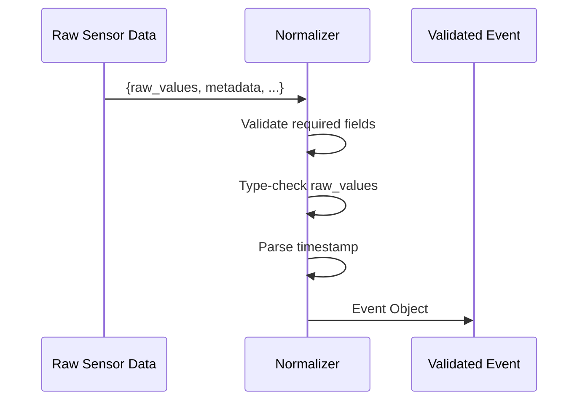
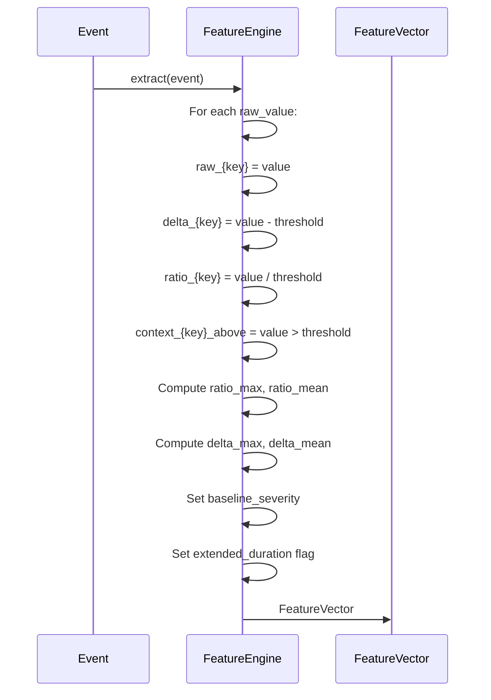
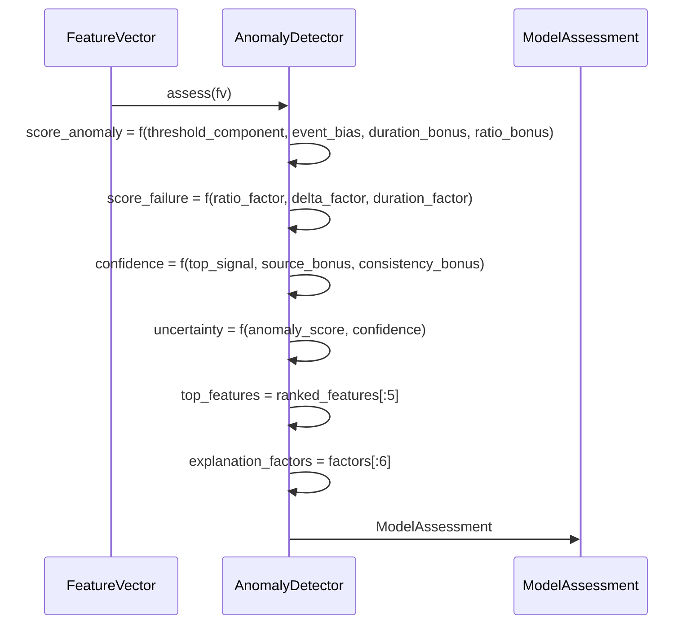
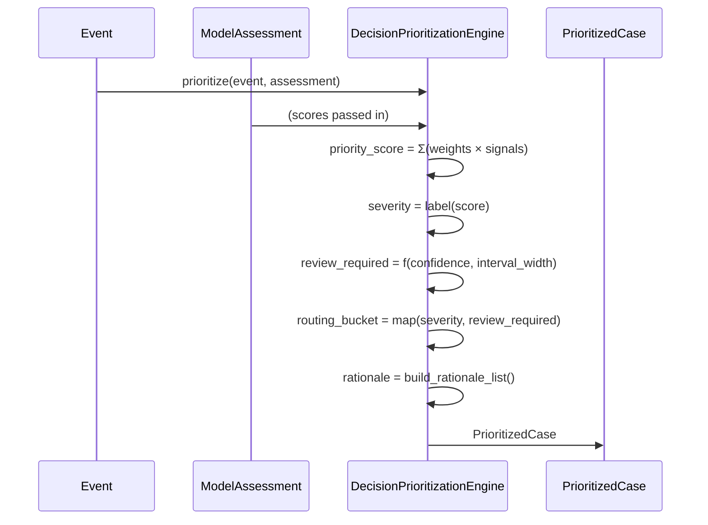
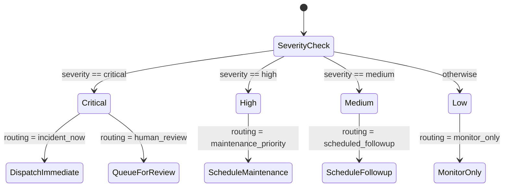
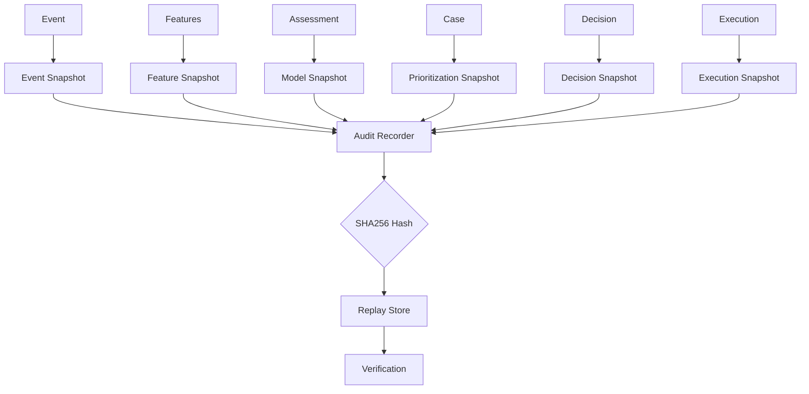

# Astraea Architecture

## System Design Principles

### 1. Determinism First

Every component in Astraea is designed to be deterministic:

```
Input A → System → Output B (always)
Input A → System → Output B (identical)
```

**Implications:**
- No timestamps used in scoring (except for recency weighting)
- Fixed threshold values from configuration
- Pure mathematical operations with no side effects
- Reproducible hash verification at every stage

### 2. Pipeline Stage Isolation

Each pipeline stage is isolated with clear inputs/outputs:

```
Stage N-1 Output → Stage N Input
Stage N Output → Stage N+1 Input
```

**Benefits:**
- Easy to debug individual stages
- Independent testability
- Clear error propagation
- Modular replacement capability

### 3. Audit as a First-Class Citizen

Audit recording is not an afterthought — it's built into every stage:

```
Every Stage → Snapshot → Hash Contribution
All Snapshots → Deterministic Hash
```

---

## Component Architecture

### Backend Structure

```
backend/
├── api/
│   ├── main.py              # FastAPI endpoints (v0 + v1)
│   └── middleware.py        # CORS, rate limiting
├── shared/
│   └── schemas.py           # Data contracts (Event, FeatureVector, etc.)
├── ingestion/
│   └── normalizer.py        # Event validation and normalization
├── ml/
│   ├── anomaly_detector.py  # Scoring with uncertainty quantification
│   └── model.py             # Frozen logistic model training/loading
├── decision/
│   ├── prioritizer.py       # Ensemble scoring and routing
│   └── engine.py            # Decision resolution and action mapping
├── execution/
│   ├── dispatcher.py        # Execution planning and team assignment
│   └── consequence.py       # Business impact estimation
├── audit/
│   └── recorder.py          # Snapshot collection and hash generation
├── reasoning/
│   ├── graph.py             # Graph-lite reasoning engine
│   └── multi_event.py       # Multi-event correlation
├── evaluation/
│   └── run_eval.py          # Synthetic evaluation harness
├── core/
│   ├── pipeline.py          # Main orchestrator
│   ├── replay_engine.py     # True replay re-execution
│   ├── replay.py            # Case persistence
│   ├── config.py            # Pydantic settings
│   ├── floci.py             # Optional local cloud emulation
│   └── retention.py         # Artifact lifecycle management
├── auth/
│   ├── routes.py            # JWT auth endpoints
│   ├── models.py            # User model
│   └── security.py          # Password hashing, JWT
└── db/
    ├── models.py            # SQLAlchemy models
    ├── crud.py              # Database operations
    └── session.py           # DB session management
```

### Frontend Structure

```
app/
├── page.tsx                 # Landing proof console
├── layout.tsx               # Root layout with fonts
├── globals.css              # Global styles + custom properties
├── engine/
│   └── page.tsx            # Inspection cockpit
├── evaluation/
│   └── page.tsx            # Claim matrix and benchmarks
├── architecture/
│   └── page.tsx            # Topology and health
└── api/                     # Next.js API proxy routes

components/
├── nav.tsx                  # Navigation bar
├── hero.tsx                 # Hero section with SSE streaming
├── demo-walkthrough.tsx     # 7-stage streaming demo
├── audit-section.tsx        # Replay verification panel
├── system-mode-switch.tsx   # Operating stances
├── consequence-layer.tsx    # Business impact framing
├── system-architecture.tsx  # Interactive topology
├── system-metrics.tsx       # Metrics display
└── footer.tsx               # Footer

lib/
└── data.ts                  # Frontend data contracts and fetch helpers
```

---

## Data Flow

### Event Ingestion


```mermaid
sequenceDiagram
    participant Sensor as Raw Sensor Data
    participant Norm as Normalizer
    participant Event as Validated Event

    Sensor->>Norm: {raw_values, metadata, ...}
    Norm->>Norm: Validate required fields
    Norm->>Norm: Type-check raw_values
    Norm->>Norm: Parse timestamp
    Norm->>Event: Event Object
```

**Normalizer Responsibilities:**
1. Validate all required fields exist
2. Ensure `raw_values` are numeric
3. Parse ISO8601 timestamps
4. Normalize metadata structure

### Feature Engineering


```mermaid
sequenceDiagram
    participant Event as Event
    participant FE as FeatureEngine
    participant FV as FeatureVector

    Event->>FE: extract(event)
    FE->>FE: For each raw_value:
    FE->>FE:   raw_{key} = value
    FE->>FE:   delta_{key} = value - threshold
    FE->>FE:   ratio_{key} = value / threshold
    FE->>FE:   context_{key}_above = value > threshold
    FE->>FE: Compute ratio_max, ratio_mean
    FE->>FE: Compute delta_max, delta_mean
    FE->>FE: Set baseline_severity
    FE->>FE: Set extended_duration flag
    FE->>FV: FeatureVector
```

### Anomaly Detection


```mermaid
sequenceDiagram
    participant FV as FeatureVector
    participant AD as AnomalyDetector
    participant MA as ModelAssessment

    FV->>AD: assess(fv)
    AD->>AD: score_anomaly = f(threshold_component, event_bias, duration_bonus, ratio_bonus)
    AD->>AD: score_failure = f(ratio_factor, delta_factor, duration_factor)
    AD->>AD: confidence = f(top_signal, source_bonus, consistency_bonus)
    AD->>AD: uncertainty = f(anomaly_score, confidence)
    AD->>AD: top_features = ranked_features[:5]
    AD->>AD: explanation_factors = factors[:6]
    AD->>MA: ModelAssessment
```

**Scoring Formula:**
```
anomaly_score = 0.45 × threshold_component
              + 0.35 × event_bias
              + duration_bonus
              + ratio_bonus

failure_probability = 0.45 × ratio_factor
                    + 0.35 × delta_factor
                    + 0.20 × duration_factor

confidence = 0.65 × top_signal
           + source_bonus
           + consistency_bonus
```

### Decision Prioritization


```mermaid
sequenceDiagram
    participant Event as Event
    participant ASSESS as ModelAssessment
    participant DPE as DecisionPrioritizationEngine
    participant PC as PrioritizedCase

    Event->>DPE: prioritize(event, assessment)
    ASSESS->>DPE: (scores passed in)
    DPE->>DPE: priority_score = Σ(weights × signals)
    DPE->>DPE: severity = label(score)
    DPE->>DPE: review_required = f(confidence, interval_width)
    DPE->>DPE: routing_bucket = map(severity, review_required)
    DPE->>DPE: rationale = build_rationale_list()
    DPE->>PC: PrioritizedCase
```

**Priority Weights:**
```python
weights = {
    "anomaly": 0.38,      # Primary signal
    "failure": 0.30,      # Secondary signal
    "severity": 0.22,     # Event type baseline
    "recency": 0.10,      # Time decay
}
```

### Decision Resolution


```mermaid
stateDiagram-v2
    [*] --> SeverityCheck
    SeverityCheck --> Critical: severity == critical
    SeverityCheck --> High: severity == high
    SeverityCheck --> Medium: severity == medium
    SeverityCheck --> Low: otherwise
    
    Critical --> DispatchImmediate: routing = incident_now
    Critical --> QueueForReview: routing = human_review
    
    High --> ScheduleMaintenance: routing = maintenance_priority
    
    Medium --> ScheduleFollowup: routing = scheduled_followup
    
    Low --> MonitorOnly: routing = monitor_only
```

### Audit Recording


```mermaid
flowchart TD
    A[Event] --> B[Event Snapshot]
    C[Features] --> D[Feature Snapshot]
    E[Assessment] --> F[Model Snapshot]
    G[Case] --> H[Prioritization Snapshot]
    I[Decision] --> J[Decision Snapshot]
    K[Execution] --> L[Execution Snapshot]
    
    B --> M[Audit Recorder]
    D --> M
    F --> M
    H --> M
    J --> M
    L --> M
    
    M --> N{SHA256 Hash}
    N --> O[Replay Store]
    O --> P[Verification]
```

---

## Deployment Architecture

### Local Development

```
┌─────────────────────────────────────┐
│          Next.js Frontend            │
│         localhost:3000               │
│                                     │
│  ┌─────────────────────────────┐   │
│  │       React Components       │   │
│  │  Hero / Pipeline / Audit     │   │
│  └─────────────────────────────┘   │
└──────────────┬──────────────────────┘
               │ HTTP
               ▼
┌─────────────────────────────────────┐
│          Python Backend              │
│                                     │
│  ┌─────────────────────────────┐   │
│  │     API Routes              │   │
│  │  /api/cases  /api/run       │   │
│  └─────────────────────────────┘   │
│               │                     │
│  ┌─────────────────────────────┐   │
│  │    AstraeaPipeline           │   │
│  │  Event → Decision → Audit   │   │
│  └─────────────────────────────┘   │
└─────────────────────────────────────┘
```

### Production Considerations

For production deployment:

1. **API Routes** should call Python as subprocess or via socket
2. **Replay Store** should use distributed filesystem or object storage
3. **Pipeline** should be containerized with Docker
4. **State** should be managed via Redis or similar for scaling

---

## Performance Characteristics

| Operation | Latency | Notes |
|-----------|---------|-------|
| Event normalization | < 1ms | Simple type casting |
| Feature extraction | < 2ms | O(n) threshold checks |
| Anomaly scoring | < 1ms | Pure computation |
| Decision prioritization | < 1ms | Weighted sum |
| Hash computation | < 5ms | SHA256 per case |
| Total pipeline | < 15ms | End-to-end |

---

## Security Considerations

1. **Input Validation** — All event fields validated before processing
2. **Hash Integrity** — SHA256 prevents tampering
3. **Optional PostgreSQL** — Database persistence when DATABASE_URL is configured; JSON artifacts for local/demo
4. **JWT Authentication** — Token-based auth for protected endpoints
5. **Rate Limiting** — Configurable per-endpoint rate limits