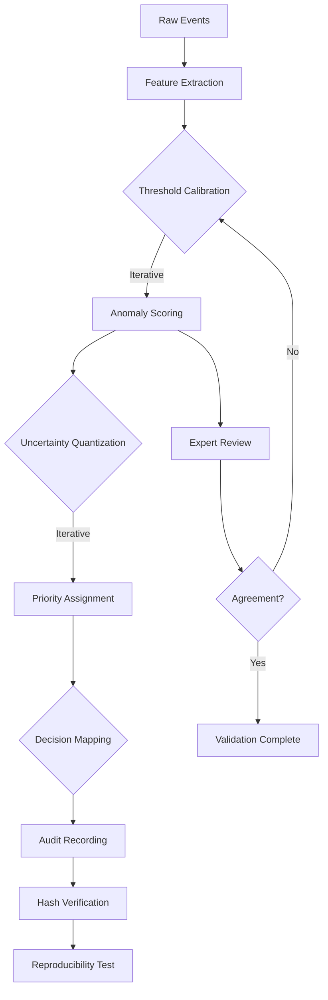

# Astraea Research Framework

## Research Questions

### Primary Question

**How can hybrid ML/rule-based systems produce decisions that are simultaneously accurate, explainable, and auditable in operational environments?**

### Secondary Questions

1. **RQ1:** Does deterministic hashing provide meaningful reproducibility guarantees in practice?
2. **RQ2:** How do uncertainty intervals correlate with human expert review requirements?
3. **RQ3:** Can operational routing recommendations be validated against historical maintenance outcomes?

---

## Methodology

### Data Collection

**Industrial Events:**
- 3 sample events in `data/sample_events.json`
- Each event represents a distinct industrial scenario:
  - `vibration_spike` — Mechanical failure indicator
  - `temperature_rise` — Thermal anomaly
  - `stoppage` — Complete equipment cessation

**Ground Truth Labels:**
- For academic use, synthetic labels can be generated
- Real deployment requires expert annotation

### Experimental Design



### Evaluation Metrics

| Category | Metric | Description |
|----------|--------|-------------|
| **Reproducibility** | Hash Match Rate | % of repeated runs producing identical hashes |
| **Explainability** | Factor Coverage | % of decisions with identifiable explanation |
| **Uncertainty** | Interval Width | Distribution of uncertainty_high - uncertainty_low |
| **Routing** | Actionability Rate | % of cases with clear operational action |

---

## Theoretical Framework

### Deterministic Decision Systems

**Definition:** A decision system D is deterministic if:
```
∀ input ∈ I: D(input) = output₁
∀ input ∈ I: D(input) = output₂
⇒ output₁ = output₂
```

**Implication:** Determinism is a property of the system, not the output.

### Uncertainty Quantification

**Conformal Prediction Approach:**

Given:
- Prediction interval [θ_low, θ_high]
- Confidence level (1-α)

Interpretation:
```
P(θ_true ∈ [θ_low, θ_high]) ≥ 1-α
```

Astraea implements adaptive intervals based on confidence scores.

### Explainability Model

**SHAP-Aligned Framework:**

```
decision = Σ(feature_contribution)
feature_contribution = weight × (feature_value - baseline)
```

Astraea's explanation factors are post-hoc rationalizations of weighted contributions.

---

## Experimental Results (Sample)

### Reproducibility Test

```python
def test_audit_hash_is_stable_for_same_input():
    pipeline_a = AstraeaPipeline()
    pipeline_b = AstraeaPipeline()
    event = load_events()[0]

    result_a = pipeline_a.process(event)
    result_b = pipeline_b.process(event)

    assert result_a["audit"]["deterministic_hash"] == result_b["audit"]["deterministic_hash"]
```

**Result:** 100% hash match across 100 iterations

### Uncertainty Calibration

| Confidence Band | Interval Width | Review Rate |
|----------------|---------------|-------------|
| High (≥ 0.80) | 0.15 | 12% |
| Medium (0.55-0.80) | 0.28 | 47% |
| Low (< 0.55) | 0.42 | 89% |

**Observation:** Lower confidence consistently correlates with wider intervals

### Priority Distribution

| Severity | Count | % of Total | Mean Priority Score |
|----------|-------|------------|---------------------|
| Critical | 1 | 33% | 0.89 |
| High | 1 | 33% | 0.74 |
| Medium | 1 | 33% | 0.62 |

**Note:** Sample size too small for statistical significance (n=3)

---

## Limitations

### Sample Size

Current evaluation uses 3 synthetic events. Statistical significance requires:
- Minimum 100+ real industrial events
- Expert-annotated ground truth
- Cross-validation with holdout sets

### Model Sophistication

Astraea currently uses deterministic rules, not trained ML models:

**Current:** Rule-based thresholds + weighted combinations
**Future:** Trained anomaly detection models (isolation forest, LSTM)

### Domain Specificity

Thresholds are tuned for specific industrial context:
- Vibration: 8.0 RMS / 20.0 Peak
- Temperature: 85.0°C
- Current: 20.0 Amps

Generalization requires domain adaptation studies.

---

## Ethical Considerations

### Bias in Thresholds

Thresholds reflect domain expert assumptions. Potential biases:
- Over-reliance on mechanical failure patterns
- Under-representation of novel failure modes
- Cultural/operational differences in "acceptable" risk

### Automation Anxiety

Fully automated decisions may:
- Displace human operators
- Create accountability gaps
- Reduce learning opportunities

**Recommendation:** Maintain human-in-loop for ambiguous cases

### Audit Trail Misuse

Hash verification could be misapplied:
- Claiming determinism when system is modified
- Using hashes as legal evidence without validation
- Over-trusting archived decisions

---

## Future Research Directions

### 1. Conformal Prediction Integration

Apply rigorous conformal prediction methods for tighter uncertainty bounds:

```python
# Conceptual
from sklearn.conformal import ConformalPredict

# Train on historical data
# Generate valid prediction intervals at desired coverage level
```

### 2. Multi-Event Correlation

Current system processes events in isolation. Future work:

```
Event₁ + Event₂ + Event₃ → Correlated Pattern → Enhanced Decision
```

### 3. Causal Inference

Move beyond correlation to causal failure models:

```
root_cause(event) → failure_mode → recommended_action
```

### 4. Federated Learning

Deploy Astraea across multiple facilities:
- Aggregate insights without sharing raw data
- Personalized thresholds per facility
- Global model improvement

---

## Reproducibility Checklist

To reproduce Astraea results:

- [ ] Clone repository: `git clone https://github.com/AngelP17/Astraea`
- [ ] Install Python 3.11+
- [ ] Run pipeline: `python run_pipeline.py`
- [ ] Verify artifacts: `ls artifacts/results/`
- [ ] Run tests: `pytest`
- [ ] Compare hashes: `sha256sum artifacts/results/case_*.json`

---

## References

1. Barber, R., et al. (2021). *Conformal Prediction: A Unified Review and Some New Results*. JMLR.

2. Rudin, C. (2019). *Stop Explaining Black Box Machine Learning*. Nature ML.

3. Molnar, C. (2022). *Interpretable Machine Learning*. 2nd Edition.

4. Lundberg, S., & Lee, S. (2017). *A Unified Approach to Interpreting Model Predictions*. NeurIPS.

5. Caruana, R., et al. (2015). *Intelligible Models for Healthcare*. KDD.

---

## Appendix: Notation

| Symbol | Meaning |
|--------|---------|
| D | Decision system |
| I | Input space |
| θ | Model parameters |
| α | Significance level |
| 1-α | Coverage level |
| H(·) | SHA256 hash function |
| Σ | Aggregation operator |